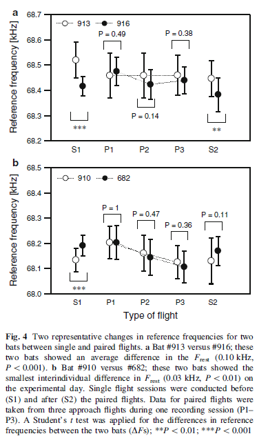
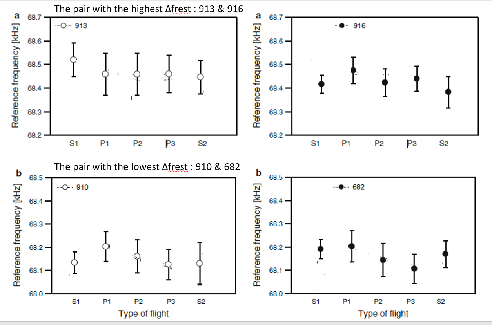

# Furusawa et al. 2012, *J Comp Physiol A*

\chaptermark{Reference frequency convergence in CF-FM bats}

*Convergence of reference frequencies by multiple CF–FM bats (*Rhinolophus ferrumequinum nippon*) during paired flights evaluated with onboard microphones* [@furusawa2012convergence]

- *notes taken on 2021-05-31*

## Introduction

* echolocation is very adaptable - and bats show various responses to overcome temporal and spectral overlap of 
other sounds to their incoming echoes. 
* The $F_rest$ (Frest from now on) is the CF frequency of the 2nd harmonic - which varies among bat species, and individuals (*'but differs slightly among individuals depending on physical constitution, sex, age, geography and morphometrics'*)
* FM species studied so far show a jamming avoidance response by shifting their call frequencies away from those of tones or the frequency bands of conspecifics. 
* CF-FM bats however need to maintain the emitted CF frequency at the reference frequency ($F_{reference}$, or Fref), as this frequency is where the acoustic fovea is at. 
* *Asellia tridens* groups didn't seem to shift Cf frequencies, but *Hipposideros terasensis* showed shifts in Frest over months when placed with other bats. 
* The Fref is slightly higher than the Frest, and thus shifts in Frest might mean there were shifts in Fref too. 
* the backpack 'telemike' system allows exact recording of emitted calls and returning frequencies - removing error in Doppler shift estimation. 

## Methods

* Japanese horseshoe bats (*Rhinolophus ferrumequinum nippon*), CF2 range of 68-70 kHz, with an iFM bandwidth of 2-8kHz, and tFM bandwidth of 8-12 kHz. 18 bats used in the long term Frest experiments
#### Change of Fref w.r.t conspecifics 
* A pre-experiment-post design was followed. 2 bats were flowing separately in the flight room, then together, and then separately again. 
* The CF2 frequency of 20 returning echoes were measured from 3 landing sequencies across the experiment. 
* CF2 freq resolution of 23.4 Hz (see Comments 1)
#### Change of Fres w.r.t to time 
* 20 calls were taken from each individual on each day -- and the mean was used to assign the Fres. Freq. resolution of 46 Hz, or 0.046 kHz
* The paired experiments dont for 8 bats, and 16 pairs --> (some bats had to be repeated in this design, not mentioned here!, how were the bats chosen?)

## Results
## Frest results 
* Frest was between 67.5-69 kHz -- however one bat was 'eliminated' (See Comment 2)
* The Frest range for a single bat was between 0.12-2.01 kHz, with the mean change being 0.5 kHz. 
* All bats showed a gradual decrease in Frest across the experiment period of ~0.22 kHz
* Of the 48(16x3) paired flights recorded, 29 of them showed $\Delta$Frest that were smaller than during single flights. Authors also found that 7 trials showed a 'significant increase in $\Delta F$s during paired flights* --*See Criticism*

## Discussion 

* Changes in Frest may be due to temperature or flight activities -- I would argue, that the vocal control of CF2 may be more variable than Fref!! 
* '*We confirmed that the reference frequency of each individual changed over a short interval between
single and paired flight sessions (i.e., the interval between S1 and P1 was\10 min*' -- this is again a matter of paradigm. The authors seem to think of Fref as a true proxy of the acoustic foveal frequency. This indirectly implies the acoustic fovea is constantly *changing*, instead of looking at Fref as relatively constant but the error in vocal control/flight speed estimation as the source of variation. 
* Authors highlight the point '*We suggest that CF–FM bats have the flexibility to momentarily change their reference frequency. The auditory system is likely capable of quickly adapting to short-term intraindividual changes in reference frequencies.*'
* '*However, it is puzzling that 11 of 16 bat pairs showed decrease in DFs compared to when they were flying alone.*' -- again, given the similarity in CF2 frequencies, and a certain amount of inter+intra trial variation, it is a matter of flipping the experimental coin enough to get results like these. 
* The general trend to a lower Frest may actually be the result of a more uniform temperature in captivity? In the beginning of the experiment perhaps the individuals are still 'tuned' to the frequency from the time of capture? 

## Criticism 

#### A parsimonious 'no-response' scenario may explain the data better. 

Since 29/48 of all paired flights seemed to show 'convergence', the authors suggest : *'This suggests that when two bats were flying together, they did not increase their $\Delta$Fs, but rather tended to shift their own reference frequencies to become much close'* -- this is an overly generous interpretation on multiple grounds:
	1. The 48 trials were not 48 independent trials. They were 16 trials with 3 replicated pairs. Another point is that the authors do not state which bats were repeated in their 16 pairs with 8 bats.
	1. It is important to note that the sample size for each trial per bat was N=20 calls. This is relatively low, especially when the authors seek to show differences that are so fine of ~40-100Hz. The significant results may be statistical false positives
	1. A parsimonious explanation of the observed data is simply that bats do not alter their Fref at all. The innate intra and inter-trial variation in emitted CF2 frequency leads to some trials having a higher/lower mean Fref by pure chance. 
	

Let's take a look at Figure 4, where the authors highlight two pairs that seem to 'converge' while in pairs (the treatments P1,2,3 -- while diverging in their solitary flights (S1,2). 

Now, let's 'clean' out all the suggestive graphical elements and statistical elements in the graphs. 

The cleaned plots suggest that individual bats may not really be responding in any systematic manner!.

#### How can the parsimonious hypothesis be shown through statistical tests? 

* Pure simulation approach: simulate a no-response scenario where bats have a certain amount of inter and intra-trial variation in Fref maintenance with 16x3 trials of paired flights.  Check what fraction of the flights show 'significant' difference 
* Data re-analysis approach: request the authors for the raw Fref measurements and perform some kind of linear mixed-model analysis to actually see if any of the 'treatments' (S1, P1, P2, P3, S2) actually has any effect on each bats Fref. If there is an effect of paired flight, one should see a systematic increase/decrease in the Fref for each bat. 

### Comments
* Suspect a typo in Methods 'Measurements of daily changes in $F_{rest}$' , the original says *'..frequency of the pulse was determined with a frequency resolution of 23.4 kHz.'*  - 'kHz' should be replaced with 'Hz'? 
* *'..(bat #908 was eliminated due to an unnatural decrease after 60 days).'* - this is an uninformative statement. Why was it considered 'unnatural', and it would also bias the results perhaps. The motivation to remove this individual from the experiment/analysis is not clear. If anything at all, as long as it could fly normally - this individual is proof that perhaps *R. ferrumequinum nippon* shows extreme fluctuations in Frest. 
* The authors do not check for a kind of 'memory' effect, where the $\Delta$F could have been compared across S1 and S2. Here too, just from looking at Fig. 4, it doesn't seem like there is one - with Fig 4b showing more difference for S1, and less difference in S2 - but Fig.4a showing apparent differences in both S1 and S2. 