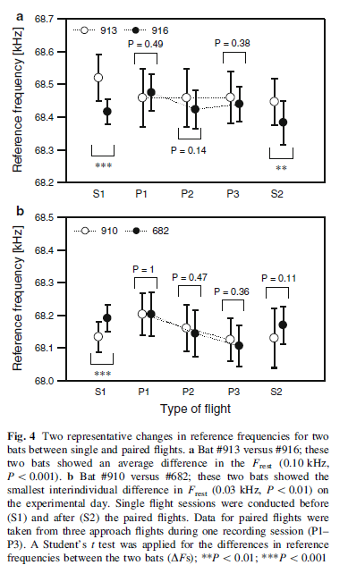
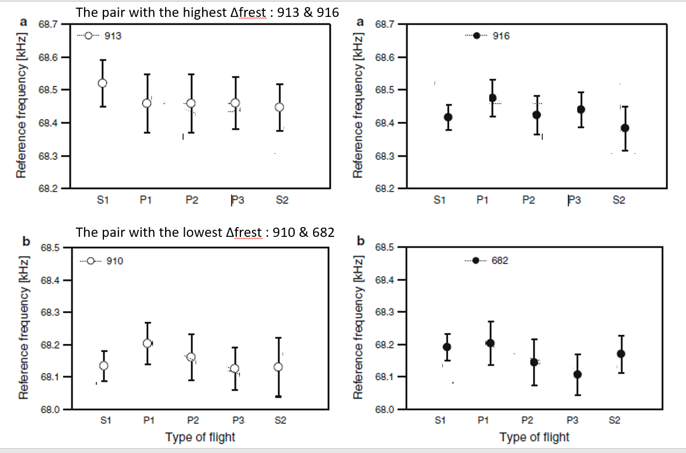

--- 
title: "Notes of all papers read so far"
author: "Thejasvi Beleyur"
date: 'Last Updated : `r Sys.Date()`'
output: pdf_document
documentclass: book
bibliography: book.bib
biblio-style: apalike
link-citations: yes
description: This is a minimal example of using the bookdown package to write a book.
  The output format for this example is bookdown::gitbook.
site: bookdown::bookdown_site
---

# What this book is about {-}
This book is a compilation of all the notes I will be making for the papers that I read from now. 
I've been realising my paper notes are scattered everywhere, across multiple folders and multiple computers, 
this is my attempt at trying to unify everything into one place. 

# How build the book after each new chapter addition
If in RStudio, with the correct R environment in place, then:

1. Open the ```index.Rmd``` file
1. 'Session-->Build all'
1. Both the pdf and html file formats should automatically be compiled one after the other.

<!--chapter:end:index.Rmd-->

---
title: "Cognitive map-based  navigation in wild bats revealed by a new high- throughput tracking system "
author: "Thejasvi Beleyur"
output:
  html_document:
    df_print: paged
---

# Toledo et al. 2020, Science
\chaptermark{cognitive maps in bats with high throughput tracking}

*Cognitive map–based navigation in wild bats revealed by a new high-throughput tracking system.* [@toledo2020cognitive]

- *notes taken on 2020-07-14*

## Introduction

- map based navigation goes beyond just simple modes eg. beacon following or landmark based navigation. 
- bats are known to return to their normal sites even after displacement, which suggests 'map-and-compass' navigation style
- Authors' previous results showed that fruit bats flew straight paths, but this was limited to a few nights of data. 
- In this study, authors managed to study 172 bats over a cumulative of 3449 nights. 

## Methods
-  *ATLAS* - a reverse GPS system, where the animal wears a tag that emits a signal which is received by multiple ground stations - and thus using TOADs, the animal can be detected. 
- ATLAS coverage region is ~88,200 hectares (or an area that's 29X29km big!!)
- bats tagged, and all fruit trees within a given region recorded. 
- Also performed translocation experiments. Each bat was translocated to the periphery of its normal foraging area, but within detection range of their foraging area
- Also performed time-lag embedding to understand how complex the navigational mechanism is 

## Results
- Bats exhibited straight tracks, which is indicative of goal-directed behabiou 
- Each bat had its favourite tree, and visited it every night, and even visited it from multiple directions of arrival
- Solid evidence for a cognitive map is when an animal moves between two points that can't be detected/seen/observed from each other (ie. it requires a kind of 'rigorous' mapping)
- 4.3% of all tracks,and 70/172 bats actually showed such shortcuts
- There was no difference in the rate at which shortcuts happened between the age groups of bats tagged
- *following a conspecific* -- they talk about it by saying that in their dataset, they didn't see individuals flying close together - but they only tagged 172 bats of ??? thousand in the whole population 
- Translocated bats were able to return to their normal foraging area 
- Time-lag embedding showed a high-dimensional correlation (?) indicating there must be many difference navigational factors
    - If bats were following a simple         navigational route, they might always arrive and depart from the same direction - but the authors don't see this. 
    - Authors don't seem convinced about the idea of an olfactory map 
    - Authors also rule out the idea of pure path integration because they show that many bats returned to a different cave than the one they started out the evening from 
    - 
### Comments
- Fig 2E: why would you use the p-value to show the *absence* of an effect? The p-value per se is hinged on so many other factors (eg.power, effect size, sample size), why not just report the raw data
- 


<!--chapter:end:01_toledo_et_al_2020.Rmd-->

# Harten et al. 2020, Science
\chaptermark{The ontogeny of a bat cognitive map}

*The ontogeny of a mammalian cognitive map in the real world* [@harten2020ontogeny]

- *notes taken on 2020-07-16*

## Introduction, Methods, Results
- Whether animals navigate using 'maps'or not remains a question. The ability to take shortcuts, or direct routes between two points is a hallmark of map based navigation. 
- The main problem with studying animal namvigation in the wild is that we can never be sure that the animal has not taken an apparent 'shortcut' before. 
- authors were able to GPS track 22 young Egyptian Fruit Bats (*Rousettus aegeyptiacus*) from their first flight out of the roost
- Young bats increased their home range over the course of ~70 nights, by which they had the same home range size as an adult. 
- Individuals showed two types of broad flight behaviour over a night, 'exploratory', where they explored for new trees, and nights where they visited prviously visted trees. 
- Evidence to support the fact that the shortcuts were intentional:
  - shortcut were as straight as familiar routes ('commutes')
  - individuals seem to head in the direction of their target from the start of the 'shortcut'
  - the 'shortcuts' could not be replicated by a random correlated walk (*this seems like a bit of a straw man null model ([link](https://www.fharrell.com/post/nhst-never/)), especially since the data is clearly so directional. The authors also specifically mention 'but without any navigational goal'*)
- *Bats performed both shortcuts and long-cuts from their first day outside,* - this is pretty impressive, but this also makes me think that the bats may actually be relying on a kind of path integration. Is their apatial memory so good that they can start mapping things over the course of one night? Is it possible that the bats may actually be using a beacon-type stategy to find their way around?
- Authors rule out olfaction and sound based cues by comparing wind direction and actual recordings made on the backpack tags. Both don't show support. 
- *'Bats that were closer to the translocation release point before the translocation night did not necessarily navigate home better, once again contradicting the template-matching hypothesis'* , the authors also go on to follow and say that bats that flew higher were better able to find their way back. This actually doesn't rule out the template matching hypothesis either, because it might just mean that bats that flew higher had larger access to the area below, to form a 'higher SNR' template perhaps...
- The authors do also admit that the navigation behaviou they observed may be a result of multiple navigation strategies: *'..., navigation is a complex behavior that probably does not always rely on a single strategy'*
- 


### Comments
- 'How animals navigate over large-scale environments remains a riddle', first line of the abstract starts with a rather bold statement. Is this statement really true for all animals, am under the impression that there is a large body of work for at least some animals. 
-  '*We documented how young pupsdeveloped their visual-based map*' - interesting, does this mean, echolocation develops later, or that the bats are known to use primarily vision for their navigation?
- Remember listening to a talk by Lee Harten in Konstanz ASAB, where she also presented work on the flight behaviour of the mother, who carried her pups around, and how the mother used to leave the pup in one tree, and so on. Do the authors discuss the implications of this type of memory on the shortcut taking ability of the young bats? *Yes, the authors have taken care of this, in the SI, they clearly state the mother and the pups were brought into an indoor facility, and the pups were kept indoors until they could fly*
- *What about bats flying together?*, or encountering each other? Their inhourse colony data kind of excludes this idea because the individual bats arrive alone, and are spaced b a few minutes. This is not the most rigorous evidence, but is still pretty indicatibe, eg. even in Orlova Chuka (and other caves), you can see the bats arrive alone in the morning. Howeer, this still doesn't really exclude the fact that bats may be encountering each other at some point over the course of the night. 
- 

<!--chapter:end:02-harten_et_al_2020.Rmd-->

# Wikelski et al. 2020 {#wikelskiearthquake}

*Potential short-term eathquake forecasting by farm animal monitoring* [@wikelskiearthquake2020]

- weird animal behaviour just before earthquakes habe been reported, including dramatic cases where snakes and rats came out of their winter burrows during the winter in the 1975 Haicheng earthquake

- finding reliable changes in animal behaviour is tough because animal the animal behaviour needs to be monitored before and during the earthquake. 

- Authors were able to overcome some of the limitations in the data this time by tagging multiple farm animals with high-resolution GPS tags that were equipped with many types of sensors

- Authors measured the behaviour of animals at the M6.6 Norcia earthquake that happened on 2016

## Methods 

- Animals chosen from a farm based on which ones the animals thought were most sensitive to the earthquakes. 

- Two tagging periods, once before + during the earthquake, once after

## Data description
- *Between ..., the animals experienced a total of 5,304 earthquakes with M > 0.4 ...and from ... a total of 12,948* ... didn't realise that earthquakes were so frequent in some areas. 

- The 'hypocenters' of the earthquakes were anywhere between 5-28 km from the farm --*all relatively close by!*

### Results 

- Find a negative correlation between time of increased animal activity and earthquake intensity. For earthquakes $\geq$ 4 M, the animals responded earlier to quakes that were closer to the farm, and later to those that were further away from the farm. 

- "Warning times" ranged from 1-15 hours

- Animals seemed to be more sensitive to earthquakes in closed buildings - but there may be a seasonal factor in the observations too

- What are the possible cues the animals are using to detect/respond to these earthquakes
    - The inverse relation hints at a diffusive type process. "air      ionization at pressurised rock surfaces" -- diffusing into the      air, to which the animals may be responding to. 

### Overall thoughts 

- very intersting paper, which quantifies something which has been known but has now been studied in greater detail through this new technology. 

- authors also suggest a future experimental setup where a series of animal moinorting stations could be used to predict the position and time of arrival of an earthquake. 


<!--chapter:end:03-earthquake_wikelski.Rmd-->

# Ratcliffe et al. 2004, Can. J. Zool.
\chaptermark{Conspecifics influence call design}

*Conspecifics influence call design in the Brazilian free-tailed bat, Tadarida brasiliensis* [@ratcliffe2004conspecifics]

- *notes taken on 2020-07-21*

## Introduction
- echolocation is pretty flexible and the emitted calls vary a lot based on the type of prey being caught, and the presence of conspecifics
- This paper is a kind of offspring of another (Avila-Flores 2003), where the authors saw that there was more call variation when bats flew together than when alone. 
- Authors try to estimate this variation by comparing observed pairs of bat calls and 'virtual' pairs of bat calls.

## Methods
- Free flying *Tadarida brasiliensis* recorded in three locations in Mexico City, of bats flying over a lake, and two others in open areas (park and city square)
- 30 sequences from each location obtained (15 single bat passes + 15 paired passes). 
- Authors specifically chose call sequences with no overlap of bat calls. 

## Analysis
- To compare the single vs paired call behaviour, the difference in the mean values was used
- The difference in the mean, $\Delta_{mean}$ was used to compare if a bat showed alterations to its echolocation when alone vs. when with another bats. 
- To understand if bats actually altered their call parameters when flying in groups the authors calculated the pair difference $bat1_{measurement}-bat2_{measurement}$ for actual observed pairs of bat call sequences, and those of virtual pairs. 
- The pair difference was calculated by subtracting the means of the $bat1_{measurement}$ and $bat2_{measurement}$

## Results
- Authors didn't find any statistical difference in call parameters across locations and so decided to pool them all together (and thus used single bat call sequences from multiple locations while making virtual pairs). (*See comments*)
- Authors found no inter-individual call differences across observed and virtual pairs for the parameters 1) call duration 2) bandwidth , and found differences in the peak frequency. (*See comments*)
- The authors also saw social calls in paired audio files. 
- The authors are indeed careful while ending '*To be even-handed....changes in peak frequency which we found...are neither jamming avoidance nor air traffic control, but serve another and as yet undetermined communicative function*'

### Comments
- authors state *'Although referred to as jamming avoidance.., support for this interpretation is not as strong as that for the jamming avoidance response in electric fish'*. They also go on to state that labortatory studies seem to have 'met with some success'. In general, does this support the fact that bats in the field may actually not be showing dramatic changes in calls at all - it's only when they're put into a quiet unusual lab context that they begin to show changes. Perhaps, this strong response is seen because the animals have gotten used to flying under quiest conditions, and are now suddenly challenged?
- how do the authors actually know that the two bats in a paired call sequence were flying together/in close proximity? '*We assinged each recorded seequence to one of two situations.....and two bats flying close proximity*' -  this is a rather vague definition. With a single bat detector, it is not possible to track the bats in 3d, at most one can check if the waveforms of the two bat calls are similar, but here too it only means that the two bats were flying in the same radius from the bat detector. It is somewhat crude, though admittedly, the best possible criteria given the current instrument. 
- Authors actually pooled call sequences from multiple locations and made virtual call pairs from this pool. This will actually have the effect of *increasing* the diversity of the observed data? Also, it is known from tracking studies that individual bats tend of have favourit foraging sites - and so in some sense, it is expected that there will be a 'local' flavour to the data. It would have been nice to see the authors perform the same analysis without pooling across locations. 
- The authors find differences in peak frequency between real and virtual pairs. This could really be an effect of where the bats were flying while in pairs vs when they were alone. The simplest explanation is that the bats may be flying further away from the microphone, thus leading to different SNRs at recording - which then leads to different peak frequencies. The difference in the peak frequency could really be an artifact and not a real effect. Moreover, given the authors state that they do see social calls, the line between social call and echolocation call is a thin one, which means, perhaps the authors are seeing this effect? The authors state this themselves *'Our recordings suggest a continuum in call features between echolocation and social calls...'*
- 

<!--chapter:end:04-ratcliffe_et_al_2004.Rmd-->

# Benediktova et al. 2020 {#benediktovadogfield}

*Magnetic alignment enhances homing efficiency of hunting dogs* [@benediktova2020magnetic]

- *Notes taken on 2020-07-22*

- 'homing' behaviour has been shown in many animals, and could be driven by multiple cues. Homing behaviour in non-migratory species still needs to be excplored more. 
- Reports of dogs that found their way back even when displaced beyond their usual home range, and without access to familiar visual cues.
- Hunting dogs have been bred by humans to chase game and then return to the start point if not followed by the hunter. These 'hunts' can ve a few hundreds to thousands of meter long. 
- These dogs may find their way back either using their own scent trail - which the authors called 'tracking' or, by actually navigating using the landmarks or information gained during the onward travel, which the authors call 'scouting'

## Methods 
- The hunting dogs were left to innately follow the olfactory tracks of game animals in the wildlife reserve
- Small dogs were used, and so there was no 'physical threat' to wild animals 
- All dogs were tagged with GPS collars, and some of the trials with dogs also had a camera involved. 
- Trials were performed with single dogs, and in areas free of high voltage power lines, roads or buildings and across the day and season (across the year)
- There needs to be some more clarity in terms of when a trial started (see *Comments*)
- Owners hid behind a tree to reduce visual beaconing
- Only excursions >200 metres were considered for this study 
- Authors split all excursions into 10 equal parts, and assigned phases to them based on the average speed of the part.

###  Return strategies
- Dog return strategies could be categorised into two classes
  - tracking: the inbound and outbound trajectory are the same , and the inbound-outbound trajectories were <30 m apart
  - scouting: a new woute was taken, and the inbound-outbound trajectories were >30 m apart

## Results
- in ~59% of all trials, dogs ended up tracking their way back, while in 33% of the trials, dogs ended up scouting their way back, and in 8% of the trials, dogs used a mic of scouting and tracking 
- Scouting dogs showed a higher average speed while returning (because they tended to take shorter routes)
- Trials bbegan and ended with no particular bias in the compass directions, though trials which were in the north-south axis, showed more efficient homing runs
- wind direction and sun location didn't seem to make a difference
- dogs returning with a scouting strategy seemed to begin by first travelling along the north-south axis, irrespective of the actual location of the destination 

## Discussion
- Authors convincingly rule out the possibility of multiple cues begin used(vision, olfaction, celestial cues). Thedogs are too short to see far, and the forest is pretty opaque. Olfactory cues are likely to change a lot, though one can't rule it out completely
- The sun's location/polarised light -- this they haven't been fully able to elimination - but they indicate that there were trials where the sun wa blocked by clouds - which would reduce the strength of polarised light 'map'
- Authors do highlight the fact that path integration is definitely one possible mechanism by which the dogs in this tudy may be finding their way back, but the question of the north-south run still remains - and it may in fact serve as a kind of recalibration run, over which the errors accumulated over path integration can somehow be 'corrected'? 


## Overall thoughts / Comments
- Really smoth introduction - easy to follow 
- It's not entirely clear how the trial exactly proceeded. The dogs were brought to a site, and then left to roam free. 
  - *The handheld GPS device was programmed to indicate when the dog had travelled ≥100 m from the position of the owner. At this moment (designated as ‘excursion start’) the owners stopped walking...*. This is the confusing part, because, what was the owner doing before that? Were the dog and the owner walking together (unleashed dog) on a trail, and then when the dog roamed far away enough, the trial was considered started. But this still elaves some room for error in terms, of wehere the dog left the 'main trail' and where the owner was when the trial started.....confusing 
- In figure 4, bottom plot - authors plot the *log* of the inbound track length against the raw beeline difference. This is a bit misleading perhaps? In general, yes, the log-transform will tend to show lesser variation - but in general, there will always be a linear correlation between te distance the animal travelled and the beeline distance ...especially if there is some kind of navigation in place... - am I being over-cautious here or not - can't make out. 
-  Pretty cool study, this study ads to the general observation of so many magnetically related behaviours (dogs peeing/pooping facing one direction (where did i read this), arctic foxes always facing one stereotyped direction before ponching onto their prey underneath the snow, and cows facing in one direction while grazing)

<!--chapter:end:05-dogsmagneticfiled_benediktovaetal2020.Rmd-->

# Habersetzer 1981 {#habersetzermadurai}

*Adaptive echolocation sounds in the bat Rhinopoma hardwickei* [@habersetzer1981adaptive]

- *Notes taken on 2020-07-22, 23*

- *Rhinopoma hardwickei* behaviour studied as they emerge from their caves. 

## Methods 
- Speed of the bat flight measured with a stroboscipic camera
- Echolocation calls recorded with a B & K microphone placed at the cave entrance. 
- *R. hardwickei* lives relatively close to the cave entrance, and are found with other batr species too. The bats flew at an altidtude of around 10-15metres above the ground
- Bats began to return to their roosts around 3:00-3:30 in the morning, but most of them returned later between 4:30-5:45 am. 

## Results
-  The author showed (I guess for the first time then) that *R. hardwickei* can actually modulate its echolocation calls, ie. by showing that the calls change over the course of a landing from classical quasi-CF to very FM
- During emergence, bats only emitted FM calls of ~3ms duration
- Emerging clusters seemed to have a preferred direction, while single bats that flew out didn't seem to have any preferred flight direction 
- Single bats also seemed to emit CF type calls, in contrast to bats that were flying in groups 
- Groups of bats sometimes formed over foraging grounds and in the early morning at the cave entrance itself. The bats in these groups emitted CF type calls. 
- Individual bats in these groups seemed to emit calls with unique CF frequencies (Fig. 4 bottom), in contrast to single bats which seem to emit at a common frequency band while flying alone (Fig. 5)
- The bats seem to split thei CF frequencies into 3 bands, 30, 32.5 and 35 kHz. 
- **R. hardwickeii** Cf calls don't seem to have an iFM or tFM unlike rhinolophids. The author seuggests this might mean that these bats are getting time delay purely through the envelpe of the call itself. I'm also fascinated by how the laryngeal mechanism must differ between the two species. Here, the absence of a FM to start/end means the bat must release the pressure uniformly over a very short period of time. 
- 

## Overall thoughts / Comments
- Pye (1972) also found something similar to this paper apparently - need to check it out. 

<!--chapter:end:06-habersetzer_adaptive.Rmd-->

# Pye 1972, J. Zool. Lond

\chaptermark{Bimodal CF calls in some hipposiderids}

*Bimodal distribution of constant frequencies in some hipposiderid bats (Mammalia: Hipposideridae)* [@pye1972bimodal]

- *notes taken on 2020-07-23* (incomplete notes, left the paper halfway through)

## Introduction

- Bats of one species seem to show echolocation in a 'common frequency band', ie. all measured bats calling within a 3kHz bandwidth
- Schnitzler 1968 found a max of 2.5kHz deviation across *R. ferrumequinum* and *R. euryale*
- Three species recorded in a cave in Kenya were however found to show 'sub-bands' with no individuals calling in between two main call frequencies. 
- 

## Methods

- CF peak frequency determined through Lissajous figures (see Comments)

## Results

- *Hipposideros commersoni*:
  - Bat seemed to emit somewhat higher frequency than expected from its size
  - Individuals either emitted at 56 or 66 kHz
  - Also measuremed the inter-nostril difference, as this is known to be ~0.5X the emitted wavelength - the nostril lengths were indeed different 
- *Triaenops afer*
  - This species also showed a bimodal distribution of CF at either 79 or 88 kHz
  - *Here it gets interesting!* When individual animal call traces were placed over each other, then the calls seemed to be somewhat continuously spaced. But when a group of bats were flown together, bats seems to emit calls clearly in one of two sub-bands
  - Fig. 2 -- could the difference in the 'combined frequency profile' vs individual frequencies just be a function of flight speed. Maybe when the bats are palced together in a cage, they tend to overall fly a bit faster/slower -- leading to this difference in the emitted frequencies by individuals?
  - 

### Comments

- interesting to see how tricky it was back then to determine the peak CF frequency, something we do so routinely with a quick FFT nowadays. Pye had to visualise Lissajous figures, (comparing the CF call recordings with signals of known frequency )
- 

<!--chapter:end:07-pye_hipposideridbats1972.Rmd-->

# Jones & Ransome 1993, Proc. R. Soc. Lond. B

\chaptermark{R. ferumequinum CF stability}

*Echolocation calls of bats are influenced by maternal effects and change over a lifetime* [@jonesransome1993]

- *notes taken on 2020-07-23*

## Introduction

- *R. ferrumequinum* emits CF calls of ~50ms long at 83kHz. 

## Methods

- Ringed wild bats were captured and recorded as they echolocated. Overall, 386 bats were recorded in the hand. 
- Bats ranged from 1-28 years old

## Results

- Age seemed increase the resting frequency (RF), with a high increase from yaer 1 to 2, and then a gradual increase. 
- There was also a seasonal effect - where the lowest RFs were recorded during the winter, and highest values in summer.
- The RF of infant bats were correlated with the RF of the mother (See comments)
- The authors also find a correlation with the age of the mother and the sex of the infant on its RF. Pups born to younger mothers had higher RFs, than those born to older mothers

## Discussion 

- authors point out that changes in RF with season may have to do with body temperature - as even active bats may not be as warm as they are in the summer. 
- The correlation between mother and pup RFs may be explained by some form of learning perhaps
- changes in RF over age could be the result of hearing loss (neural/cochlear)

### Comments

- the x and y axed of Fig. 3 aren't equal make it hard to judge visually how strong the correlation is. Numbers-wise at least, the *r* value isn't particularly high.
- back in 1993, the processing times were quick! The paper was received 1 Feb. 1993, and accepted on 16 Feb. 1993!!


<!--chapter:end:08-jonesransome_ferrumequinum_stability.Rmd-->

# Schuchmann & Siemers 2010, *PLoS One*

\chaptermark{Horseshoe bat source levels in Bulgaria}

*Variability in Echolocation Call Intensity in a Communityof Horseshoe Bats: A Role for Resource Partitioning orCommunication?* [@schuchmannsiemers2010a]

- *notes taken on 2020-07-23,24*

## Introduction

- Authors measure the source levels of a whole community of horseshoe bats near and around the Tabachka field station. They record call levels of 5 species. 
- The CF distributions of the four-five species that geographically overlap in Europe, also overlap spectrally
- *Rhinolophus mehelyi* can tell apart conspecific calls in the midst of other overlapping species (See comments)
- Do some bats (that are calling at higher than allometrically predicted frequencies) evolve towards a 'private frequency' channel?
- Authors look at whether *R. mehelyi* produce louder calls to compensate for decrease in detection distance because they call at a higher call frequency for their given body size ([Comments 2](#com_shuchsiem))

- The questions the authors ask are:
    - Are the call intensitites different across species, and could call intensities play a role in nice differentiation ([Comments 3](#com_shuchsiem)) 
    - Does *R. mehelyi*, the higher-than-allometrically predicted species, call at 'especially high' call intensities? ([Comments 4](#com_shuchsiem)) 
    - How does max. call intensity vary with body size, sex -- and could it be used as an honest signal bats can use to identify conspecifics ([Comments 5](#com_shuchsiem)) 

## Methods

### Study animals 

- *R. mehelyi, euryale, ferrumequinum, hipposideros* caught from the area around the field station, *R. blasii* caught from the Eastern Rhodopes. 
- Bats recorded in a large-ish room (8x4x2.5m) ([Comments 4](#com_shuchsiem)), and can thus be expected to emit louder calls than when in a cluttered environment

### Call intensitites and acoustic analysis

- Done with a B & K mic placed 1m away fromt he bat's head - *this is a pretty neat and direct way to do it because this is a perching bat anyways!!* ... though, the clutter caused by the mic being right in front of the bat ...hmmm...
- There;s a large variation in the frequency resolution across the years. It also is a bit unclear whether the authors used an automatic or manual method -- though my current reading seems to suggest a semi-manual method to estimate the peak frequency of a call 
- To get call intensity, the authors seem to do a lot of call processing.
    - FIR bandpass filter , with a 128 order bandpass filter([Comments 6](#com_shuchsiem))  and then proceeding to take the FFTs within the call....why do this when you can take the waveform value directly??)
- 

## Results

### Overlap of frequency bands 

- species showed overlap in their CF frequencies 
    - *R. mehelyi, euryale, hipposideros*  overlapped, while those of *R. ferrumequinum* and *R. hipposideros* were different 
- Statistically, the three overlapping species differed (but the sample sizes weren't too big either..)

### Call parameters

- No observed correlation between call intensity and call frequency 
- *R. euryale* seemed to call 10-17 dB lower than the other species. 
- Intra-individual variation of 0-334 Hz across species
-  Intra-individual call intensity variation also of between 2.3 to 5.5 dB 

## Discussion 
- authors suggest call intensity can be an informative cue that can be used to assess species identity. They propose that perching bats may be able to reconstruct the position and 'head-aim' of the other bat, and thus assess its source-level. *While it may be informative to tell apart *R. mehelyi*, which calls fainter than others - there may actually be other cues eg. FM sweeps, or even more 'voice' type characteristics embedded in the whole call that could be picked up by bats themselves?)


### Comments {#com_shuchsiem}

- 1. Need to read ref. 24, Schuchmann & Siemers 2010 (Am. Nat.) - a habituation-dishabituation study
- 2. How does the *allometry* matter per se. The only thing that will matter for the detection distance is the source level and the emitted frequency (unclear)
- 3. It seems a bit tenuous, and obvious- but it's also hard to show a connection well?. Yes, low source level bats may only be able to detect insects from nearby, and high SL bats can detect insects from far away -- not sure, but it sounds vague
- 4. I don't necessarily see a reason for it to call at higher source levels than what other species with similar CF do... not sure, why it would call at 'especially high' call intensities. 
- 5. Probably this is the 'big flight room' at Tabachka?
- 6. Vaguely remember how using a very high order filter can mess with the signal structure itself (altering phases etc.). If the signal structure itself is altered so much, then what is the guarantee that the peak eq. source level obtained in this study is valid? If anything at all, the call intensitites reported in this study may actually be at the lower end of what is known because of the heavy filtering that has been done?
- 7. Odd grammar and typos in a bunch of places.


<!--chapter:end:09-schuchmann_siemers_bulgarianhorseshoebats.Rmd-->

# Halsey 2019, *Biology Letters*

\chaptermark{Alternatives to *p*-value testing}

*The reign of the p-value is over: what alternative analyses could we employ to fill the power vacuum?* [@halsey2019a]

- *notes taken on 2020-07-24*

## Introduction

- The p value has been used and abused, and in some sense has contributed to the reproducibility crisis in science 
- The p value is based on the null hypothesis being true, and therefore doesn;t actually provide any information on how true the alternate hypothesis is -- which is actually our question. 
- If the p-value is 'high'/non-significant -- *it doesn't tell us anything because there is an open question if our method could pick up a difference given the current sample size?
- **'*Moreover, with a big enough sample size, inevitably the null hypothesis will be rejected; perversely, a p-value based statistical result is as informative about our sampole as it is about our hypothesis*'** (See comments)
- p-values can vary between replicates of the same study even when statistical power is high! (See comments)
- interpreting p-values as signficant or not (dichotomously) encourages failed experiment replication --- hmmm
- Even with 80% power ---> prob. of getting two studies/replicates significant is 0.64 (0.8$^{2}$), while getting even one of these two studies/replicates significant is 0.32($2\times0.8\times0.2$)

- **'*th ep-value is typically highly imprecise about theamount of evidence against the null hypothesis, and thuspshould be considered as providing only loose, first passevidence about the phenomenon being studied*'**

## Alternates to p-value testing:

### P-value prediction interval
- the p-value is attractive, and a nice objective indicator of evidence against the null hypothesis
- author suggests presenting *variability* of p-values across samples, because p-values can be so variable : the 'p-value prediction interval' [Cumming 2008](http://methods.sagepub.com/journal-article/sage-quantitative-research-methods/replication_and_p_intervals_p_values_predict_the_future_only_vaguely_but_confidence_intervals_do_much_better/d36.xml)

### Estimate likelihood of false positive
- This method requires a prior 'feeling'/idea of how likely it is that there will be an effect , this is kind of hard to come by for observational studies, or those where there's no literature to say anything ??
-  The author also provides an 'inverse' option, where the inputs are the obtained p-value + the power of the test. If the false positive risk is set at 5% ($\alpha=0.05$), then the tool will provide an estimate of your prior expectation that the treatment will have an effect

## Effect sizes and confidence intervals

- The effect size (differnce in mean between the groups) is easy to estimate - and a 95% confidence interval can be reported along with it. 
- The confidence interval based approach with full reporting of the info prevents false claims from being made (yes/no effect)


## Bayes factor: comparitive evidence of the null and alternate hypotheses

- the controversy about the 'subjectivity' in defining the prior can be solved by running a sensitivity analysis that explores a range of prior definitions 
- the 'simplified Bayes factor' (SIB) is an alternate index which can be used to assess (Seems to be more relevant for planned studies and their stopping rules, also see Comments)

## Akaike information criterion

- The AIC provides an idea of how well your model represents reality - and handles the tradeoff berween model complexity and over-fitting
- AIC is nice to compare between models, but it doesn't provide an absolute estimate of which model is the best. Among the models that are under consideration, it may very well be the case that the one with the lowest AIC doesn't capture the variation in the data as well as the other models - a check of the model's actual fit still needs to be done. 
 
## Conclusion

- **'*Primarily, the argument goes, you should prioritize interpretation of graphical plots of your data, where possible, and treat statistical analyses as supporting or confirmatory information*'**


### Comments
- A low p-value can thus be a result of a high effect size for a given sample size, or a very large sample size for a given small effect size. So, how does one go about disentangling this issue then?? Perhaps with power analyses -- which then adds to the amount of work that needs to be done anyway..?
- the p-value is not stable...hmm, even across replicates - this is kind of scary to know. ie. in [@halsey2015fickle], they state *'The reason for this is that unless statistical power is very high, the P value exhibits wide sample-to-sample variability and thus does not reliably indicate the strength of evidence against the null hypothesis'*, and *'If statistical power is limited, regardless of whether the P value returned from a statistical test is low or high, a repeat of the same experiment will likely result in a substantially different P value'*
- Not sure how different this simplified Bayes factor is from a p-value - I also don't understand how it overcomes the problems associated with dichotomous type p-value testing. Moreover, if the p-value itself is 'fickle', then it will also result in unstable SIB estimates too -- how to overcome this problem...
- haha, nice - the author also provides a link to another paper [Sneddon, Lewis, Bury 2017, J. Exp. Biol.](https://jeb.biologists.org/content/220/17/3007), where Box 2 has a template passage highlighting the problems of p-values! 


<!--chapter:end:10-Halsey_pvalueisover.Rmd-->

# Halsey, Curran-Everett, Vowler, Drummond, 2015 *Nature Methods*

\chaptermark{Fickle *p* values}

*The fickle P value generates irreproducible results* [@halsey2015fickle]

- *notes taken on 2020-07-24*

## Introduction

- p-values often used without understanding the statistical power in play 
- statistical power is often only considered after an 'effect' could not be detected
- unless statistical power is very high, p-values vary a lot from sample to sample 
- Ronald Fisher actually intended p-values to be used as a continuous indication of support for the null hypothesis
    - but, here too - if the statistical power is already low, no matter what - the p-value will not be reliable!!
 
## statistical power is generally low --> p values can't be trusted
- Even when statistical power is close to 90%, p-values are not stable
- Considering that many studies are designed with 80% power, this means there is probably even more variation in p-values to be expected
- low statistical power -----> low sample sizes --> higher data variability

## Exaggerated effect sizes 

- A low-power test will give a low p-value only when the samples are very unrepresentative (ie. come from the edges of the distribution) -- but it can definitely happen (Comments)


### Comments

- the possibility of extreme samples contributing to low p-values, may also lead to a dramatic effect size. In some sense, there may be no *statistical* way to overcome this problem - the only way to resolve this situation may be to increase sample size?
- 


<!--chapter:end:11-halseyetal_ficklepvalues.Rmd-->

# Li et al. 2014, *Behav Ecol Sociobiol* (Incomplete)

\chaptermark{Behavioural responses to sympatric echolocation calls}

*Behavioral responses to echolocation calls from sympatric heterospecific bats: implication for interspecific competition* [@li2014behavioral]

- *notes taken on 2020-07-27*

## Introduction

- sympatric species with simlar diets and ecologies could share information and gain mutual benefit through this process. Mutual recognition is required for mutual benefit to occur.
- agression between species at the same trWophic level should be selected against by natural selection as it increases the risk of predation
- In free-flying bats, species recognition has been shown to be related to simlarity in call structure and diet ecologies 
- *'Interspecific recognition may thrterefore be necessary to adjust the strength of interspecific interactions'* - what is meant by this line - adjusted by whom?
- the trophic niche index - how 'linear'/uniform is it as an index? 
- Authors tested which bats responded to which bats, and checked if call similarity and trophic overlap explained the observed correlation 
- 3 species were tested, among the 4 species that are commonly found together:
    - *Rhinolophus macrotis*
    - *R. macrotis*
    - *R. lepidus*
All the rhinolophid species were observed in the expeirments --but there were no *Asellia*'s in this experiment. ( *Asellia stoliczkanus*)

 ([Comments 1](#com_libehav))


## Methods

- 

## Results


## Discussion 


### Comments {#com_libehav}


<!--chapter:end:12-Li_etal_sympatricspeciesrecognition.Rmd-->

# Ming et al. 2020, *PNAS* 

\chaptermark{Modelling frequency hopping in echolocation}

*How frequency hopping suppresses pulse-echo ambiguity in bat biosonar* [@Ming17288]

- *notes taken on 2020-07-28*

## Introduction

- In cluttered environments, echoes that arrive after the next call can cause call-echo ambiguity. 
- When interpulse interval (IPI) is > 'echo-epoch' (time taken for the last echoes in the acoustic scene to arrive, $\alpha$ 'depth' of the scene) - then there is no ambiguity
- Echoes from the previous call that arrive can appear to be objects that are very close by.
- However, in cluttered conditions, bats reduce their IPI to keep up the update rate, which means the chance of such ambiguities is higher. 
- 'Frequency hopping' helps to overcome this call-echo matching problem. 
- *Eptesicus fuscus* shows shifts of upto 5-7 kHz between one call to the next while doing this kind of echo hopping. However, even a shift of 5-7 kHz means an overlap of 70-80% from one call to the other ([Comments 1](#com_ming))

### Quick primer on echo delay estimation

- In manmade ranging systems (radar/sonar), all frequencies in a wideband sweep contribute equally to the matched filtering. 
- In *E. fuscus*, the first harmonic is required for echoes need to have a first harmonic to be 'registered', but the second harmonic (FM2) plays a stronger role in modulating echo delay perception. 
- Authors test the specific idea that even *within* the first harmonic itself, *E. fuscus* only needs a limited region of the FM1 to detect echoes. 

## Methods

- Authors test if 1) only the lowest paer of FM1 frequencies are required for delay perception 2) unclear what is being *tested* here..*'Second, the small, seemingly not very effective, size of the frequency hopping by just a few kilohertz ....suggests that the hypothesized necessity of these lowest FM1 frequencies may be the key to why the harmonics are processed asymmetrically'* 
- More and more of the lower frequencies were filtered out and the bats were asked to detect the S+ ([Comments 3]{#com_ming})
- If the authors want to understand which parts of the echo are important - why do they focus on an AFC (alternate forced choice) experiment where the task is to tell apart two echoes - with different arrival delays *and* different structures (single glint vs double glint) ([Comments 4]{#com_ming})
- It seems like *both* phantom echoes were high/low passed filtered - but this isn't explicityly stated in the paper!
- 4 *E. fuscus* were trained in an alternate force choice experiment
- 


## Results

- the region between 29-30 kHz is important for the bats to tell apart S+ and S-
- Confusing *'Finally, when all frequencies are removed from S+ by low-pass filtering at 20 kHz, there is no two-glint S+ at all,..'* - if 'all' frequencies are removed - there is no echo at all in principle, fo
- '*..vast proportion of frequencies do not support perception of echo delay unless the critical frequencies of 25 to 30 kHz are present.*'
- authors also cite previous studies where when FM bats were faced with CF playbacks, they responded strongly to playbacks between 24-28 kHz, and didn't respond at all when other frequencies were played back. 


## Discussion 

- The authors seem to discuss the implications of the last few kilohertz results into how frequency hopping works -- they haven't actually shown this directly through the experiments. The data only says the last few kilohertz is important for echo delay detection. 
- The results indicate that the last few kilohertz is important - but at the same time don't point to a mechanism which allows the bat to detect echoes which are frequency shifted - how would the bat register the fact that the 'terminal frequency' has moved up after it's shifted its echolocation? This is not really discussed in the paper directly ?..


## the SCAT model 

- the SCAT model is a bio-inspired model which aims to mimic how the auditory system of bats work. 
- delay perception is done by parallel bandpass filters which detect the time between sounds with energy in their bandpass region. Thus, they are able to tell the delay between call and echo fairly accurately. 
- The idea the authors propose is essentially that the lower part of each call is the one that triggers echo detection. 
- Imagine one call with terminal frequency at 20 kHz, and the next call with the terminal frequency at 25 kHz. Even if an echo from the previous call were to arrive - it'd have much lower frequencies than that of the current - call and wouldn't be 'sent' into the processing chain. ([Comments 5]{#com_ming})


### Comments {#com_ming}

1. How is this overlap actually calculated - it can be done in multiple ways...including/excluding the second harmonics etc..? As the authors themselves mention later - a shift of 5-7 kHz in the first harmonic corresponds to a shift of 10-14 kHz in the second harmonic. 
2. Fig. 2 is the first figure that is referred in the paper (and the one that brings the phenomenon to the reader directly) - but, Fig.1 (related to a more technical point) is presented first - could have been rearranged. 
3. S+ is introduced without any kind of explanation, and the figure is the main reference for the paper. This is kind of understandable given the word limits, but it's also kind of unfortunate because the reader's flow is interrupted each time by having to go back and forth between sections of the paper. 
4. I'm  not able to understand why the authors trained the bats to distinguish two echoes that differ in two characteristics. Am wondering how this would affect what can actualy be said from the experiments. ie. the results could also be narrowly interpreted to say, 'bats require the lowest parts of their FM1 to tell apart a double glint echo from a single glint echo' ... It would have been cleaner if the authors had actually compared the bats ability to tell apart two echoes with the same structure, but arriving at different delays -- this would actually say something about what is required to detect an echo, rather than a double glint vs a single glint echo. The task is made *easier* by the introduction of such different properties *'..question is whether this easy task still is easy (sic) if the lowest fre quencies in FM1 are removed from the S+ echoes'*, but the point is that it may also muddle the interpretation? 
5. There seems to be a disconnect between what was done and what is being discussed. What was shown is that the end frequencies are important for echo discrimination (the glint structure X different delays confuses things according to me). But what is being discussed is how the frequency hopping is reliant on the lower frequencies of each call - the authors haven't really 'shown' this experimentally - but suggest a model which may explain it. There's something that I can't put into words better - need to give this a second try again. 
6. The authors don't show the actual double glint echo - which is somewhat odd too. 

### Additional comments from AFEG Paper primer meeting on 2020-08-04 (Leonie, Paula, Holger, Thejasvi)

(Leonie leading, and other group members commenting)

- As the authors state, when the low pass is at 20kHz -there should be no 
double glint echo (silence on one side), which means the bats only choose the double glint,
instead of just reverting to the side with one echo. This seems kind of odd 
- The bat could actually be using frequency based cues, rather than 
the delay
- Not so many experimental details - a supplementary information could have been included 
- The results only say that the last few kilohertz is important for telling apart S- and S+ - it doesn't necessarily
say whether this part plays a role in glint enumeration (single vs double) or delay acuity!
- Authors haven;t really shown that in general the last few kilohertz aer important between calls, but the authors here have only shown that 
25-30 kHz is important. 
- 


<!--chapter:end:13-Mingetal_pulseechoambiguity.Rmd-->

# Lakens, Daniel, blog post from *'The 20% statistician'*

\chaptermark{Adjusting alpha for statistical tests}

*Why you don't need to adjust your alpha level for all tests you'll do in your lifetime* [@daniellakensa_2016]

- *notes taken on 2020-08-04*

## Introduction

- Take a case where people are randomly assigned into two groups, and two unrelated dependent variables are measured. The groups are compared. True positive of no effect on both the variables is: 0.95 X 0.95 = 0.9025. Probability of at least one of the variables showing up as significantly different is: 1 - 0.9025 = **0.0975** !! How to control such erroneous false positives?

- There are a bunch of methods which can control the 'error rates':
    1. Bonferroni correction
    1. Holm-Bonferroni sequential procedure

- When the # of statistical tests increase, it may be better to control false discovery rate, rather than error rates.

## The Bonferroni correction
 
- *'The Bonferroni correction controls the familywise error rate..'* [*what is family wise error rate - See* Comments]{#lakens_com}
- *'..is not straight forward is that error control does not just aim to control the number of erroneous statistical inferences, but the number of erroneous theoretical inferences.'*. Is the author trying to say that corrections need to be done when a bunch of tests are trying to answer the same question, with a common dataset - don't fully understand
- Experiment wise Type I error rates (*I guess this is the famous p value?*) can be calculated from the setup of the stats? The example given by the author here is in a 2x2x2 ANOVA (See [Comments 2]{#lakens_com}) - there are seven tests that are done, and so when a 0.05 $\alpha$ is used each time, this make the probability of getting at least one effect at least 30%. *([Comments 3]{#lakens_com})*

- The author also gives a more experimental example. The case of comparing predictions from two theories. One theory predicts interaction in a 2x2 ANOVA, and the other doesn't predict an interaction, but at least one main effect. (A 2x2 ANOVA tests 3 null hypotheses, two main effects and one interaction).  
- A naive way to approach the Bonferroni correction is to set the $\alpha$ to $\frac{\alpha}{3}$ 
- But here the author points out that because theoretically the two theories predict different outcomes, the $\alpha$ also needs to corrected separately. Since Theory B predicts at least one significant main effect (out of 2 main effects) - we can set the new $\alpha$ to $\alpha /2$ and so if the p < $\alpha/2$ we will accept Theory B
- Since Theory A predicts only one interaction being significant, we don't really need to correct for anything. ([Comments 4]{#lakens_com})
- Maintaining a sensible $\alpha$ value with multiple testing corrections allows you to be wrong at most at the expected $\alpha$ rate.
- Should you correct for all the tests you will do over your lifetime? Yes, but only if all the data/work you've done is going into testing one single theory !
- *'..criticism on corrections for multiple comparisons is that it is strange that the conclusions a researcher draws depends on the number of additional tests a researcher performs.'* - here the authors cites the case of a 2 group comparison being significant at 0.05 (p=0.04), but when including a second dependent variable, the $\alpha$ is now 0.025, which means the first variable data no longer rejects the null hypothesis. ..*'Lowering alpha levels is a mathematical necessity when you want to control error rates, but it is not needed if ..you..quantify relative likelihoods of the data under different hypotheses.'*. Does the author mean that the comparison of the two groups for each of the dependent variables corresopnds to two independent null hypotheses? In what way is this different from the 2x2x2 ANOVA that was just discussed before?

- You can also increase the alpha, and sometimes this makes sense to do so - ie. while pre-registering two studies, you can set the alpha at 0.2236, and decide that only if *both* studies show $p<0.2236$ will the null hypothesis be rejected. This is effectively the same as setting the overall $p$ at 0.05 because 0.2236X0.2236 = 0.05 - [Comments 5]

- *'There is only one reason to calculate p-values, and that is to control Type 1 error rates using a Neyman-Pearson approach.'* - the focus here is on controlling false positives. 


## Comments/Questions {#lakens_com}

1.  what is a 'familywise error rate': The probability of making at least on Type I error (False Positive): $FWE \leq 1-(1-\alpha_{test})^{Number\ of\ comparisons}$. eg. at an $\alpha$ of 0.05 and with 10 tests, the $FWE$ is : $\leq (1-0.05)^{10}=0.401$ (thanks to this [page](https://www.statisticshowto.com/familywise-error-rate/))
1. 2x2x2 ANOVA is when there are three variables and two groups in each variable. ie. imagine you're testing a drugs efficacy, and you have three variables (Thanks to this [page](https://www.graphpad.com/guides/prism/7/statistics/stat_what_is_three-way_anova_used_f.htm)) : sex, dosage level and treatment/control. Within Sex there's male and female, within dosage level there's high and low, and then there's treatment/control. There are seven p-values because it performs a series of comparisons within the 2x2x2 complex:
    - 3 tests  comparing the groups within each of the variables (eg. male vs female, treatment vs control, high vs low)
    - 3 tests testing two-way interactions: pool data from Sex, effect of treatment vs control in low and high dose groups 
    - 1 test on three way interaction: *'there is no three way interaction among all three factors'*

1. I get this example, within one statistical test, there are seven comparisons being made - and when each of these have an alpha value, there can be a false positive - what about when you are performing single comparisons of multiple variables from two groups?
1. I guess one of the main issues that the author is trying to bring out is that by naively correcting and setting $\alpha$ values very low, we risk running into Type II (false negative) errors! By setting 
1. What would have happened if the alpha was still set at 0.05 for both studies, then the effective false positive rate would have been 0.025 -- which is perhaps too conservative? Also, with an alpha set at 0.2236, the probability of a false negative is: 

<!--chapter:end:14-Lakens_2016.Rmd-->

# Culina et al. 2020, *PLoS Biology*

\chaptermark{Low code availability in ecology}

*Low availability of code in ecology: A call for urgent action* [@culina2020low]

- *notes taken on 2020-08-11*

## Introduction

- There is more and more awareness on the part of journals and authors to be more open about the data and code. 
- FAIR principles (See [this paper](https://www.nature.com/articles/sdata201618)):
    * Findable
    * Accessible
    * Interoperable
    * Reusable

## Methods

- Authors try to quantify how oftent scientists share their code, and were able to identify 346 non-molecular studies between 2015 and 2019
    - Has code availability increased over time?
    - How well are authors actually following prescribed practices related to code sharing (FAIR principles, etc.)
    - *'limits to computational reproducibility'* ([Comments 1]{#comments_culina})

## Results

- The number of journals requiring code sharing has gone up -> positive trend.

### Low code availability

- 90% of all software *used* was either GUI or command line code, though the authors even went to the extent of including papers that had screenshots and instructions on how to use the program. ([Comments 2]{#comments_culina})
- Only 27% of all surveyed articles had code that had some or all of their code available. ([Comments 3]{#comments_culina})

### Findability, accessibility, and reusability

- Authors point out a very relevant points '*To be found, code availability should ideally be stated within the article or, if not, within the supplementary material of the article.*' 
- 24% of all articles that actually provided the code didn't state it at all -  but instead had broad references to the supplementary infor. 
- Authors point out that even though archiving code with the supplementary information of the journal works - journal access is not always universal - and this can affect accessibility!
- Authors suggest the use of Dryad and Zenodo to archive code - which makes sense.
- *'We oped to simply evaluate whether the published code had some form of documentation (e.g.README), either as an accompanying document or embedded at the beginning of the code, and whether the code had inline comments explaining parts of the code.'* ([Comments]{#comments_culina} 4)


### Limits to computational reproducibility

- Only 21% of all articles provided both code and data together 
- Previous estimates of computational reproducibility showed only between 18-80%.
- Even in the papers which provided both data + code --> 26% ofc the papers used proprietary software ([Comments]{#comments_culina} 5) 


### Comments {#comments_culina}

1. Not clear what is meant by 'limits to computational reproducibility' here. 
1. Personally, I don't quite consider screenshot based records very reproducible, because they don't scale well with the number of steps. There are so many details to take care of often, and this is just a very cumbersome way to record and to read and try to reproduce an analysis. 
1. Woah, even though the authors were relatively lax in their definition of what constitutes reproducible code -- even then just about one in three surveyed papers had the associated code with it. 
1. Here too the authors have actually been generous with their criterion for what documentation actually is. I understand that most people will not have the time or training to document their code to the point where it is completely self-contained - but this is also the problem. 
1. Another reason to avoid using proprietary software - it reduces the rate at which others can use your code *and*, most importantly, excludes the quick replication of your results if someone wants to 'fact check' it. In general, I can see how certain proprietary softwares may do the job well, but it also means it's an ivory tower - and no one can look into it. However, what can be done is to ensure a coomon set of coding standards are being followed nonetheless (code documentation, tests, READMEs, etc). I'm sure there must be a bigger discussion about this in the literature, as these are my first guesses/thoughts. 
1. The authors seemed to have used an automated tool to find their papers - 'Rayyan' - interesting. This tool may be helpful in the future perhaps?!


<!--chapter:end:15-culina_2020_lowcodeavailability.Rmd-->

# Wilkinson et al. 2016, *Scientific Data*

\chaptermark{FAIR principles for data management}

*The FAIR Guiding Principles for scientific data management and stewardship* [@wilkinson2016fair]

- *notes taken on 2020-08-11*

## Introduction

- *'data stewardship includes the notion of 'long-tem care' digital assets, with the goal that they should be discovered and re-used for downstream investigations*
- *'Humans, however, are not the only critical stakeholders in the milieu of scientific data.'* - authors refer to the fact that 'computational agents' (like bots for eg?) are becoming equally important in the curation/searching of knowledge
- Many field-specific databases exist with their own formats and curating workflows - eg. protein databanks, astronomy
- There are more and more discipline agnostic databanks coming up nowadays - FigShare, Dryad, Mendeley DAta, EUDat, DANS, DataHub
- This increase in multiple databases and systems, may actually be making it harder to keep track of datasets for human and 'computational stakeholders'
- When a researcher is looking to compare the data they've generated with pre-existing datasets - how to go about this task? 
    - the search needs to be passed through various filters, data formats, species etc. -- it can get complicated finding the relevant result
- *'The goal is for scholarly digital objects of all kinds to become 'first class citizens' ....where the quality of the publication-and more importantly, the impact of the publication-is a function of its ability to be accurately and appropriately found, re-used, and cited over time, by all stakeholders, both human and mechanical.'*
- there are already machine actionable formats out there, eg. the ones used in many databanks and space sciences etc, but the aim is really to come up with something that is broad, so that a machine can decide on a dataset's relevance/contents even though it hasn't seen it before. 
- This site [https://fairsharing.org/](https://fairsharing.org/) seems to be pretty useful in detailing many of the publicly accessible databases/data repositories, and also details the various file formats out there, among other things. 

### The significance of machines in data-rich research environments 

- humans have a better understanding of what is relevant and what is not while searching, but human searching is not scalable. 
- To enable automatic searches/curation - datasets need to be machine actionable', ie. have machine parsable identifiers, info on the type of objects, licenses, consent and etc. 
 


### Comments

- This paper talks about some ideas which are definitely going to be important. One thing that confused me is that they talk about databases/repositories which are exemplary in the paper (DataVerse, FAIRDOM, ISA, Open PHACTS, etc), but don't mention any of the other ones (eg. Dryad, Zenodo, FigShare, etc) - a comparison would have been nice to understand why these were not included. I can also see that there is a clear discipline-based bias in where people upload their datasets based on where their colleagues do it too. 
- In general, the comment about the growing number of databases/repositories is a very valid one. While reading this paper itself I began to realise how narrow my overall awareness for various databases is!


<!--chapter:end:16-wilkinson_etal_2016.Rmd-->

# Goldshtein et al. 2020, *Current Biology*

\chaptermark{SHORT TITLE HERE}

*Reinforcement Learning Enables Resource Partioning in Foraging Bats* [@goldshtein2020reinforcement]

- *notes taken on 2020-08-28*

## Intro-Methods-Results

- '*Every evening, from late spring to mid-summer, tens of thousands of hungry lactating female lesser long-nosed bats (*Leptonycteris yerbabuenae*) emerge from their roost and navigate over the Sonoran Desert, seeking for nectar and pollen*' : Comment 2
- Something I'm seeing in papers and am responding to. 'We hypothesised..' without clearly stating the reason behind it. 
- *..quality of a specific cactus can vary dramatically according to the number of flowers it opens on a given night* - somewhat misleading sentence. Comment 3
- Fig 1A. - showing the number of open flowers per cacti - could have shown a *discrete* colour bar. The use of a continuous color bar for integers is very confusing. 
- *'Moreover, bats have to re-map the field every night.'* - not clear why, or what this statement is based on 
- *Although we found a significant correlation between the number of flowers on consecutive nights, there was much inter-night variability* - the reference to the figures aren't v clear : Comment 4, 5
- '*...because a conspecific might deplete it in the meanwhile (the bats' behaviour suggests they do not know whether a floewr was recently visited...)*' - 
S1E captioned erroneously perhaps Comments 6,7
- *'Finally, all of these data were used to develop a mathematical model..'*, hmmm, this is a bit semantic, but aren't evolutionary simulations , *simulations* and not 'mathematical models' as such. 
- GPS tracked 17 bats, and then finally reconstructed the foraging sites of 8 bats. This must have been a lot of work over all! Perhaps, the authors even actually tagged more bats - and considering the problems with tag losses and animal recaptures - this must have been quite an effort. 
- Commuting speed was 8.7 m/s ground speed (~31km/h), and commutes correspond to ~46% of the time spent away from the cave
- Even within a cactus field - each bat concentrated its foraging in a narrow part about 0.14 km$^{2}$ in area (0.14 km$^{2}$ is ~ 374x374 m$^{2}$) 
- Plants that were visited $\leq$ 5 times were considered to belong to the bats'  'core cacti' - Comment 8
- *'Indeed, video analysis revealed that cacti with more flowers were visited significantly more often'* - this triggered the thought -  do the authors actually report if bats visited multiple flowers per visit? This might be another way that bats learn to identify which cacti are worth visiting multiple times, and those which are not. Also did core cacti have more flowers than those around them? 
- In the reinforcement learning simulations, the bat remembers the top ten cacti it visited according to the amount of nectar it provided at that point of time ('nectar weight'). The next cactus to be visited is determined based on its  nectar weight and inversely proportional to its distance from the current plant.

- '*Importantly, we did not fit the data in order to find the learning rate $\alpha$*' - this is not true. An evolutionary algorithm is one of many types of algorithms that can be used to estimate a parameter. All of these algorithms use some kind of minimisation/maximisation algorithm. An evolutionary algorithm just uses the fitness of the agent, which is in turn affected by the cost functions in the model itself. Moreover, the authors do use the actual data to parameterise the evolutionary simulations themselves. I don't see how the act of using an evolutionary algorithm means the parameter is not being fitted in the same way a common linear regression fits the data to get coefficients. This is logical wrong, and also misleading - adds an air of deeper sophistication than there actually is. 

- Authors show that when compared to a trapline model or a random search model, the reinforcement model matched various aspects of the observed dataset well (inter-visit distances, revisit time intervals)

- Authors also ran simulations with aggressive behaviours in the agents, unlimited cacti memory (instead of a fixed 10 plants) - and still saw the appearance of non-overlapping core plants across multiple individuals

- '*We prove analystically that...*' - missing reference to [29] (Korman et al. 2020, ArXiv preprint) 

- '*Interestingly, a single-parameter model based on reinforcement learning was able to closely reproduce the bats’ behavior*' - in some sense -- is this really a single-parameter model? The learning rate $\alpha$ makes sense only in the context of the many other parameters that were used to setup the model right? Would the same learning rate be valid given that the bats flew at a different speed or the plants were placed at different spatial arrangements. This is not a fully generalisable result I feel....also isn't 

- 


### Comments

1. The authors state *'Many species have been suggestd to follow a trapline, that is, to revisit the food sources in a repeating ordered manner...We thus hypothesized that lesser long-nosed bats would visit cacti in a sequenced manned.'*. Is this a legitimate form of hypothesising. Isn't it closer to expecting to *examining*/checking if the bats perform sequenced foraging? Am wondering if this kind of formulation is the effect of the NHST type thinking, where there is one hypothesis that needs to be formulated and either rejected or supported.
1. Like it as an opening line. Very graphic, and very evocative of what is being studied. The sentence could have been shorter though. 
1.  The sentence creates the impression that quality is somehow influenced by the number of flowers open - as if they were *two* variable. But instead, here, the authors actually define the *quality* of a cactus by the number of flowers it has open!
1. Comment about figure S1 in general. This is a very compact graph, that prevent leisurely inspection of the data. Annother approach would have been to give one page to each graph and legend. This is the supplementary information section after all. (Does Current Biology have page limits even for this section?)
1. Figures S1C,D: it's not clear to me why the 'independent model' looks the way it does. If there is no correlation at all between the last and current night there should be equal transition probability for any transition (0-10 flowers, 0-9, 1-10 etc..) - but here too there is some kind of clustering. Why is this the case - more details are required to explain the model. The explanation by itself is not detailed enough for criticism or replication. 
1. S1E captioned 'Bats probably cannot identify which flowers *they* previously visted' - emphasis mine. - the caption refers to a bat knowing which flowers it previously visited while the main text refers to the idea that bats may not be able to tell if other conspecifics previously visited. Although in the following sentences the situation is corrected. 
1. Figure S1F refers to the *order* of visitation, and not really to whether bats can tell if a flower has been previously visited or not. This is confusing. Also S1F1,2 are incredibly small figures 
1. The authors choose the points at which the derivative of the probability mass function (PMF) drops to zero. I'm thinking about how generalised this approach is. It works and it intuitively makes sense for *this* particular PMF because the probability of increasing visits drops very drastically, and the distribution is right-skewed. The same definition would have failed if the PMF had been more flat, or bi-modal-ish. Another option would have been to use an X% cumulative probability approach, ie. the #of visits at which the X%ile of the data is seen. This is robust to the exact shape of the distribution. 
1. What kind of 'cost function'/ metric was used. The exact parameterisation of this could have an effect of the types of decisions the agents end up showing. 

 


<!--chapter:end:18-Goldstein_et_al_2020_reinforcementlearning.Rmd-->

# Lu et al. 2020, *J. Exp. Biol.*

\chaptermark{Horseshoe bats' response to noise playbacks}

*Echolocating bats exhibit differential amplitude compensation for noise interference at a sub-call level* [@lu2020echolocating]

- *notes taken on 2020-09-28*

## Introduction

- In humans, the Lombard effect is known to occur at the sub-sentence level, and even at the sub-word level. Certains words in sentences were stressed more than others, and even parts of words themselves were stressed more than others. 
- So far, no work looking at whether animals can perform such similar sub-vocalisation amplitude compensation. Authors try to answer this question in two species of Hipposiderid bats. 


## Methods
- 6 *H. armiger* and 5 *H. pratti* used in the study. 
- Like the fact that they authors state very clearly how they compensated the frequency response of the microphones and speakers. 
- Animals were placed on a roost with 15 microphones pointing to the animal above
- Lowest received level recordable by the mics were 28 dB SPL rms (background noise level)
- White noise between 10-100 kHz was played back at 3 levels:
    - 40, 52, 64 dB rms SPL
- Fig.1 : Not clear where exactly the speaker was in relation to the bat. Fig 1. D makes it look like the speaker was placed to one side of the bat -- which is a somewhat odd position - given that there could be side biases or even side-filtering effects due to this. 
- Also played, bandpass or band-removed white noise 
- The 'Call analysis' section - doesn't really 'develop' a workflow beyond what is currently out in the published literature, neither is the code uploaded anywhere. Not sure why the authors claim to have 'developed analytical tools to conduct automated sub-call level analyses.' as outlined in Fig S2 and the description istself. For instance, see [@siemers2005species] or [@schoeppler2018precise] - who use the same methodology.
- The authors also don't really state how they are able to estimate the actual call levels of the call after having accounted for the noise playbacks. 

## Results
- Authors use a linear-mixed model and then report the estimated difference in received level in comparison to the silence - am wondering if this is too 'processed' somehow. Does the story remain the same even if simple measures are used like the median? (this is a very crude thought!)
- Bats seem to show an increase in FM amplitude when in the presence of any kind of noise - but especially strongly in the presence of 10-100 kHz noise. 
- tFM duration also seems to increase in *H. armiger* by upto 0.6 ms - this increase is not negligible, considering the FM itself can be just a few ms long. 
- The bandwidth of the FM also seems to increase by a few kHz in the presence of increasing noise playback levels in *H. armiger*
-  Against expectations, the authors also found that non-band noise playbacks resulted in a Lombard effect. 


## Discussion 


### Comments
- The description of the band-passed and band-removed noise playbacks is not very clear. It was good that the authors decided to put the schematic in Fig 4. 
- '..developed analytical tools to conduct automated sub-call level analyses.' - the code is sadly not uploaded anywhere online, and the authors state in the Call Analysis section 'Original scripts for sound analysis of this study will be provided upon request.'. Also, the statement 'All data needed to evaluate the conclusions are present in the paper or the Supplementary Materials.' is a bit of an oxymoron - this is the bare minimum that is required anyway. The next statement again points out to the whole idea of contacting the authors 'Additional data related to this paper may be requested from the authors' - this step of contacting the authors only adds more hindrance to double checking work or using data for other purposes. 
- There seems to be some odd-ish self-citations in some places (only showing one here). For instance, ...'amplitude of mammals is largely determined by the subglottal air pressure' has a citation to Luo & Wiegrebe 2016 - which actually studies another topic, and only mentions this same fact that amplitude is determined by subglottal air pressure. I find this citation 
out of place and unnecessary - as the paper itself is not a primary reference where this result has been determined or supported.


<!--chapter:end:19_Lu_etal_2020_horseshoebats.Rmd-->

# Yamada et al. 2020, *Scientific reports*

\chaptermark{spatial learning + echolocation in R. ferrumequinum}

*Modulation of acoustic navigation behaviour by spatial learning in the echolocation bat *Rhinolophus ferrumequinum* * [@yamada2020modulation]

- *notes taken on 2020-10-15*

## Introduction

- Bats are known to handle complex environments and modulate their echolocation accordingly
    - beam shape, direction, pulse interval, call duration etc.
- 'doublets' and 'triplets' are known to be emited when there is clutter and thought to improve object resolution 
- Spatial memory however also plays a role in how bats echolocate. *Eptesicus fuscus* reduce call rate and show an increasingly stable flight path as they fly over time in a fixed environment. 
- Bats may actually use their spatial memory to fly in challenging environments, and may not rely on the 'actual' sensory feedback all the time. Authors designed a flight maze where bats didn't/had access to 'sensory information' in terms of the extent to which echoes returned from obstacles. 


## Methods

- Bats had to fly in a 'S' shaped flight path, the flight path was created with 2 types of walls: acoustically permeable and acoustically inpermeable. 
    - The acoustically permeable wall was made of plastic chains hanging from the ceiling. It's considered acoustically permeable because the sound can pass through the gaps in the chains. 
    - the acoustically impermeable wall was made of boards. 

- 14 initially naive bats split into 7,7 between the two 'treatments'
    - each bat was flown 12 times in the flight treatment, and the 1st and 12th flight trials were analysed - to observe changes.
- *"If bats coordinate flight relying on their spatial memory rather than acoustic sensing, there would be no remarkable differences in the learned flight behaviours between the acoustically permeable wall and reflective wall conditions."* . Not really. See Comments [1,2]
- Beam direction estimated from the 20 mics placed all around the room. This is something I'm not so sure can be done accurately without mics on the obstacles themselves. Beam width can already be extremely narrow in horseshoe bats, and on top of that - an obstacle may shadow the beam a lot anyway -- and this might actually prevent detections of calls made in the direction of the obstacle itself! Comment [4]
- 


## Results

- *'Overall, the statistical models that we describe in the Methods and Materials section...fit the data well and explain more variance than the respective null models with..'* - not really necessary, and not in context of any particular results 
- Bats actually emitted mostly doublets and triplets  in both flight conditions 
    - Over time flying the setup, the numberof emitted calls and triplets fell in both treatments 
- Authors *do not* measure source level - which would have been a very important parameter to understand detection of echoes/obstacle avoidance
- Faster flights had fewer calls emitted - (a sign that the bat is 'bolder' and thus willing to take more sensorimotor risk somehow?)
- Figure 5 c,d : the authors use a GLMM with 7 individuals, two treatmetns, measured twice. Is there enough power in there to detect differences given the sampling intensity?
- 

## Discussion 


### Comments

1. The target strengths of the 'acoustically permeable' and impermeable treatments are by their very nature different. This means that the two walls will be detected at different distances/ the reflected echoes will have a much higher received level. The received level being higher in one treatment than the other itself may cause all kinds of different responses. How to control for this. Perhaps the bats are not really 'using' the echoes of the objects behind but rather relying only on the received level of the echoes? 
1. One of the other things the authors could have done to control for the difference in target strengths is to make impermeable chain walls or permeable acrylic sheet walls. This would remove aspects such as directionality of the object -- even though it might actually be really hard to equalise target strength. 
1. No DATA or CODE published online. 
1. The authors also state a previous publication to show that the beam shape direction can be accurately recreated - but this is with the same/similar microphone arrangement *without* obstacles


<!--chapter:end:20_Yamada_et_al_2020.Rmd-->

# Griffin, Donald, 'Listening in the dark', 

\chaptermark{Listening in the dark}

*Listening in the dark* [@griffin1958listening]

- *notes taken on 2020-11-17*

- *'Echolocation is still a topic that resists neat classification into any conventional category of science. It ramifies into widely different scientific disciplines iunclusing ethology, mammalogy, physiology, psychology, acoustics, nd the mathematical theory of signal detectionl. The results of new investigations have reemphasized the necessity of a broad biological perspective for any serious appreciation of echolocation. *

- page 58: about Spallanzi's work *'Yet only a regrettably small propotion of his obserations and conclusions became widely enough known to win any general acceptance among zoologists, and even today much of his work remains unpublished.What is known of it serves amply to confirm the proposition that one can often learn more from a careful study of the thoughts of a master than from years of firsthand research.'*

- 'The apparatus then in use by Pierce was called a sonic detector, and it consisted of a crystal microphone located at the focus of a long parabolic horn, cacuum tube amplifiers to increase the minute electrical votages generated by such a crystal when ssound waves impinge upon it, and circuit ....'

- page 80: 'And finally, just what can bats perceive by echolocation, how close must objects of various sizes be before they can be detected, under what conditions does echolocation perhaps fail to serve bats as well as in our laboratory tests, and how do dozens or hundreds of bats manage to fly in the same part of a cave without interfering with each other's acoustic orientation?'


- page 85: 'Until very recently only one reliable type of microphone has been available which could be calibrated over the frequency range required to study bat sounds, that is....'

- page 166: 'Echolocation cannot be an easy or an automatic process for the bats; it must require attention, skill, and metnal effort, albeit perhaps wholly unconscious effort like that involved in walking through underbrush or riding a bicycle.'
- page 166: 'Evidently when bats are flying through familiar surroundings they rely to an increasing extent on their memory of spatial relations acquired on previous flights through the same space.'

- page 180, chp 7: 'There were a few practical difficulties standing in the way of this objective. Microphone, pre-amplifier, and portable raio could all be operated from dry batteries, and indeed my original apparatus for listening to bat sounds during their pursuit ofinsects was all carried in a single box strapped to my back by means of a rucksack frame. A cathode ray oscillograph was something else again, but a small one could be operated from a storage batter therough a vibrator which acted as a converter of direct to alternating current. '

- page 181, chp 7: 'Finally after several evenings of hectic preparations and gradual elimination of operating difficulties, I was ready with the microphone and parabolic horn now mounted on a bracket not unlike a tommy gun, the trigger bying a swirch for remote control of the motion picture camera which was to photograph the oscillograph screen.'

- page 201, Chp 7: 'This presented certain difficulties, for people are prone to wonder when a man walks about wearing ear phones connected to a box with dials, and carries in his hand a parabolic horn. Various explanations were suggested quite audibly, but the onlookers seldom noticed the bats though we were pointing the horn toward them at every opportunity. When one youth suggested to his companions that we might be listening to the bats he was derided and drowned out with knowing statements about radio receivers and cosmic rays. '

- page 367, Chp 14: 'To be sure, background noises at ultrasonic frequencies are nto of nearly so great marnitude as sounds of lower frequencies resultring from natural causes such as rustling of begetation by the wind, insect sounds, or the noise produced by running water. But other bats must be a major source of possible interference, and it is only natural to wonder why the many bats whichfly in a single cave do not "jam" each other since each one is busy filling the air with its won pulses.'

- page 386 Chp 15: 'A little of the naturalis'ts viewpoint is required to comprehend more fully the significance and the boundless variety of precisely adapted functional microcosms among which we live. But it is even more obvious in this period of scientific history that we can no longer expect to understand nature by merely describing and cataloging her variety. We now have tools at our disposal which can help us to deeper and more satisfying insights. It is in this context that I hope the phenomena of echolcoation will be contemplated, so that they may serve to exemplify the potential role of an analytical approach to natural history.'

## Chapter 1: The nature of bats

* There is a diurnally active microchiropteran - *Lavia frons*
* Griffin also gives tips for houseowenrs who'd like to get rid of bats in their house - close up the cracks over the winter or when the bats are not roosting. 

## Chapter 3 : The Acoustic Orientation of Bats

* Hahn, an American scientist, had shown the ears of a bat are important for its orientation. He was the first to use the wire-mesh protocol to assess how well bats avoid obstacles.

* So interesting to see that there was a 'rediscovery' of many sorts. Galambos and Griffin also put open/closed tubes onto bat ears o see if that made any difference. 

* Sven Dijkgraf began studies on bats and notice dthe *Ticklaut* - in German occupied Netherlands.

## Chapter 4: The Voices of Bats

* Griffin used cathode ray oscillographs to figure out the call durations of bats. 

* To study the directionality of bat calls - Griffin had to make a bat fly past a camera taking photos, and placed  2 mics at 90 degrees separation! Wow -- and look at me with the *Ushichka* dataset and >10 mics everywhere!!!

## Chapter 5: The hearing of bats

* Mentions issues with figuring outt he behavioural hearing thresholds w animals - esp at freqs where they are not v sensitive - as there may be tonal impurities as certain frequencies are played back at v high thresholds


### Chapter 6: Successs and Failure of Bats' Acoustic Orientation 

* Moehres and Oettingen-Spielberg performed experiments w bats kept over long periods of time, and foudn bats were bery faithful to their own memory. Bats were in fact reluctant to fly into a part of the room where a partition had been removed!  (Möhres, F. P., & Oettingen-Spielberg, T. (1949). Versuche über die Nahorientierung und das Heimfindevermögen der Fledermäuse. Verhandlungen der deutschen Zoologen in Mainz, 248-252.)

* Griffin also describes experiments where he trained an *E. fuscus* to capture prey from the same part of a flight room over a long period, and then put obstacles while the bat was feeding. The bat seemed to constantly crash into the new obstacles - even though it was emitting calls all the time!


### Chapter 7: The pursuit of insect prey

* Spallanzi already did experiments back in teh 1800's where he found agroup of bats - blinded some and left the others as they were. He then compared their stomach contents after capturing them in the morning -and saw the blinded bats had the same number of insects as the ones with intact eyes

* Intersting how Griffin mentions studies where bats were *shot* and their stomach contents examined - it seemed like this kind of approach was fairly common and not so negatively seen as today. 

* Bats seemed to accumulate about 1.3 grams/hour of insects while foraging - data from observational studies looking at stomach contents over the time period from roost emergence

* Exciting descriptions of how the study of echolocation research actually did move from *laboratory* to *field* -- exactly what the whole Ushichka dataset tries to achieve for group echolocation.

* Crazy to think of the kind of basic technology that Griffin had to use to reveal all the things he did! There were *separate* instruments called 'sound spectrographs' which would actually produce spectrograms -- and he writes about how this helped him a lot in studies looking at natural echolocation during insect capture.

* pg 193, 'Experiments with false echoes ' - Griffin writes about his first attempts to create what was later named 'phantom echoes' by Moll?

### Chapter 14: The acuity of echolocation 

* in the section 'The discrimination of echoes from interfering noise': 


<!--chapter:end:21_Listeininginthedark.Rmd-->

# Moehres & Oettingen-Spielberg 1949, *Verhandlungen der deutschen Zoologen in Mainz*

\chaptermark{Short-range orientation and homing in bats}

*Versuche ueber die Nahorientierung und das Heimfindevermoegen der Fledermauese* [@mohres1949versuche]

- *notes taken on 2020-11-23* (first attempt at reading and making notes for a German paper)

* authors start by stating that many long-distance orientation behaviours are often driven by unknown senses. Studying short range orientation could provide support. 

- Experiments done on *Rhinolophus ferrumequinum* and *Myotis myotis*.

- Many short and long-range orientation bheaviours are driven by the same sensory systems - even though they may predominate differently in each behavioural context. 

- Authors exploit the fact that bats get used to roosting in spot - which can be a cage. They can be made to fly out of the cage by letting out an insect, and then their flight trajectories can be studied over time. 


- The authors make a valid point that closed spaces like flight rooms are indeed very similar to bats' natural environments, as caves are essentially closed spaces. 

## Experiments 

- Authors released bats from a cage to capture insects. They turned the cage door 90degrees to another side while the bat was capturing the insect and observed what the bat actualy did. They found that most of the time the bats constantly attempted to enter the 'wrong' side of the cage - even though they could detect the fact that the current cage surface did not have an opening. 

- Moving and turning the whole cage in the flight room never affected the return flights, as long as the door direction was kept the same

- The authors also began dismantling the cage gradually until there nothing of it anymore. Even then, the bats constantly seemed to return to an imaginary cage and even try to 'hang' from an imaginary ceiling of the cage. 

- Authors also noticed that bats seemed to constantly search for insects in the 'usually' kept places first - and then only look elsewhere. 

- Authors also had a section of the room that was initially inaccessible, and then made accessible. The bats did not fly easily into the part of the room that was later made accessible. Bats always in flew in gradually increasing inward flights, while always returning to their familiar volume. 

## Conclusions
- Authors suggest that bats may use echolocation to first form their impressions of the volume they are flying in. 
- They state it's not possible to directly infer how bats can orient so well in space. 
- They also discuss the possibility of bats reducing/reducing their dependence of echolocation as they gain familiarity with a space they are flying in. 


## Comments 
* Intersting that in this 'report' they talk about how they have just obtained funding from the 'Notgemeinschaft der Deutschen Wissenschaft' and, that they will publish the discussed results in detail in the 'Zeitschrift fuer vergleichende Physiologie' (Now Journal of Comparitive Physiology)


<!--chapter:end:22-moehres-spielberg_heimfindvermoegen.Rmd-->

# Morey et al. 2016, Psychon Bull Rev

\chaptermark{Confidence in confidence intervals}

*The fallacy of placing confidence in confidence intervals* [@morey2016fallacy]

- *notes taken on 2020-12-21*


## The folk theory of confidence intervals 

* confidence interval is a range which has X% prob. of containing the true parameter $\theta$
* *confidence procedure* : the 'process' used to generate a confidence interval. 
* Many misconceptions surrounding the use/understanding of what CI's stand for

## 1.0 Fundamental confidence fallacy 
* the common misconception is that if X% of all confidence intervals drawn will have the true paramete, then it 
must be that it implies there is an X% probability of the calculated CI having the true parameter
* *the issue is that the X% probability holds for multiple runs, and not for this ONE trial!*. Having created a confidence interval
there is no way to know whether it has the true parameter in it or not!! We may have had the luck of getting the X% of CIs with the 
parameter in it, or the 1-X% luck of getting a CI without the parameter in it!
 
## 2.0 Precision fallacy

* The width of the confidence interval is taken to show the precision with which a parameter can be estimated. 
* This need not necessarily true. eg. the authors show how a dataset split into two subsets can have similar means, but very different variance, and thus different confidence intervals around the mean. It does not necessarily mean that the estimate is 'less precise'!

## 3.0 The likelihood fallacy

* One common misconception is that CIs include the most likely values of a parameter
* *A confidence procedure may have a fixed *average* probability of including the true value, but whether on any given sample it includes the 'reasonable' values is a different question* 
* However, the values given by a CI can be very misleading, and it can be that the values are actually misleading

## The theory of confidence intervals 

* The width of the confidence interval is linked to its *power*, in the sense of excluding 'false values' in the interval. This is where the choice of the confidence procedure (CP) plays an important role. For example, among two CPs, one of them may always provide CIs that exclude false values -- which means it has a higher *power*. 

## Early skepticism 

* *'Neyman had developed a behavioral theory designed to control error
rates, not a theory for reasoning from data'* -- authors state this in the context of saying that the idea of CIs wasn't to generate meaning/help interpretation from them, but rather to to generate a protocol for parameter estimation that will work out correctly most of the time. 

## Examples 
(Did not fully follow either of the examples, and so didn't make notes!)

## Discussion 
* Authors highlight the mismatch between the original purpose of CIs and their actual use in the literature: *'Confidence
interval theory was developed to solve a very constrained
problem: how can one construct a procedure that produces
intervals containing the true parameter a fixed proportion
of the time?'*

### Guidelines for interpreting and reporting intervals 

* *'Once one has collected data and computed a confidence
interval, how does one then interpret the interval? The
answer is quite straightforward: one does not – at least not within confidence interval theory.'*

* 1. Report credible intervals instead of confidence intervals wherever possible
* 2. Don't use confidence procedures that aren't supported with a Bayesian basis
* 3. Warn the readers that the CI is not a Bayesian interval!
* 4. 


<!--chapter:end:24-Morey_etal2016_fallacyconfidenceintervals.Rmd-->

# Furusawa et al. 2012, *J Comp Physiol A*

\chaptermark{Reference frequency convergence in CF-FM bats}

*Convergence of reference frequencies by multiple CF–FM bats (*Rhinolophus ferrumequinum nippon*) during paired flights evaluated with onboard microphones* [@furusawa2012convergence]

- *notes taken on 2021-05-31*

## Introduction

* echolocation is very adaptable - and bats show various responses to overcome temporal and spectral overlap of 
other sounds to their incoming echoes. 
* The $F_rest$ (Frest from now on) is the CF frequency of the 2nd harmonic - which varies among bat species, and individuals (*'but differs slightly among individuals depending on physical constitution, sex, age, geography and morphometrics'*)
* FM species studied so far show a jamming avoidance response by shifting their call frequencies away from those of tones or the frequency bands of conspecifics. 
* CF-FM bats however need to maintain the emitted CF frequency at the reference frequency ($F_{reference}$, or Fref), as this frequency is where the acoustic fovea is at. 
* *Asellia tridens* groups didn't seem to shift Cf frequencies, but *Hipposideros terasensis* showed shifts in Frest over months when placed with other bats. 
* The Fref is slightly higher than the Frest, and thus shifts in Frest might mean there were shifts in Fref too. 
* the backpack 'telemike' system allows exact recording of emitted calls and returning frequencies - removing error in Doppler shift estimation. 

## Methods

* Japanese horseshoe bats (*Rhinolophus ferrumequinum nippon*), CF2 range of 68-70 kHz, with an iFM bandwidth of 2-8kHz, and tFM bandwidth of 8-12 kHz. 18 bats used in the long term Frest experiments
#### Change of Fref w.r.t conspecifics 
* A pre-experiment-post design was followed. 2 bats were flowing separately in the flight room, then together, and then separately again. 
* The CF2 frequency of 20 returning echoes were measured from 3 landing sequencies across the experiment. 
* CF2 freq resolution of 23.4 Hz (see Comments 1)
#### Change of Fres w.r.t to time 
* 20 calls were taken from each individual on each day -- and the mean was used to assign the Fres. Freq. resolution of 46 Hz, or 0.046 kHz
* The paired experiments dont for 8 bats, and 16 pairs --> (some bats had to be repeated in this design, not mentioned here!, how were the bats chosen?)


## Results
## Frest results 
* Frest was between 67.5-69 kHz -- however one bat was 'eliminated' (See Comment 2)
* The Frest range for a single bat was between 0.12-2.01 kHz, with the mean change being 0.5 kHz. 
* All bats showed a gradual decrease in Frest across the experiment period of ~0.22 kHz
* Of the 48(16x3) paired flights recorded, 29 of them showed $\Delta$Frest that were smaller than during single flights. Authors also found that 7 trials showed a 'significant increase in $\Delta F$s during paired flights* --*See Criticism*


## Discussion 

* Changes in Frest may be due to temperature or flight activities -- I would argue, that the vocal control of CF2 may be more variable than Fref!! 
* '*We confirmed that the reference frequency of each individual changed over a short interval between
single and paired flight sessions (i.e., the interval between S1 and P1 was\10 min*' -- this is again a matter of paradigm. The authors seem to think of Fref as a true proxy of the acoustic foveal frequency. This indirectly implies the acoustic fovea is constantly *changing*, instead of looking at Fref as relatively constant but the error in vocal control/flight speed estimation as the source of variation. 
* Authors highlight the point '*We suggest that CF–FM bats have the flexibility to momentarily change their reference frequency. The auditory system is likely capable of quickly adapting to short-term intraindividual changes in reference frequencies.*'
* '*However, it is puzzling that 11 of 16 bat pairs showed decrease in DFs compared to when they were flying alone.*' -- again, given the similarity in CF2 frequencies, and a certain amount of inter+intra trial variation, it is a matter of flipping the experimental coin enough to get results like these. 
* The general trend to a lower Frest may actually be the result of a more uniform temperature in captivity? In the beginning of the experiment perhaps the individuals are still 'tuned' to the frequency from the time of capture? 

## Criticism 

#### A parsimonious 'no-response' scenario may explain the data better. 

Since 29/48 of all paired flights seemed to show 'convergence', the authors suggest : *'This suggests that when two bats were flying together, they did not increase their $\Delta$Fs, but rather tended to shift their own reference frequencies to become much close'* -- this is an overly generous interpretation on multiple grounds:
	1. The 48 trials were not 48 independent trials. They were 16 trials with 3 replicated pairs. Another point is that the authors do not state which bats were repeated in their 16 pairs with 8 bats.
	1. It is important to note that the sample size for each trial per bat was N=20 calls. This is relatively low, especially when the authors seek to show differences that are so fine of ~40-100Hz. The significant results may be statistical false positives
	1. A parsimonious explanation of the observed data is simply that bats do not alter their Fref at all. The innate intra and inter-trial variation in emitted CF2 frequency leads to some trials having a higher/lower mean Fref by pure chance. 
	

Let's take a look at Figure 4, where the authors highlight two pairs that seem to 'converge' while in pairs (the treatments P1,2,3 -- while diverging in their solitary flights (S1,2). 



Now, let's 'clean' out all the suggestive graphical elements and statistical elements in the graphs. 



The cleaned plots suggest that individual bats may not really be responding in any systematic manner!.

#### How can the parsimonious hypothesis be shown through statistical tests? 

* Pure simulation approach: simulate a no-response scenario where bats have a certain amount of inter and intra-trial variation in Fref maintenance with 16x3 trials of paired flights.  Check what fraction of the flights show 'significant' difference 
* Data re-analysis approach: request the authors for the raw Fref measurements and perform some kind of linear mixed-model analysis to actually see if any of the 'treatments' (S1, P1, P2, P3, S2) actually has any effect on each bats Fref. If there is an effect of paired flight, one should see a systematic increase/decrease in the Fref for each bat. 


### Comments
* Suspect a typo in Methods 'Measurements of daily changes in $F_{rest}$' , the original says *'..frequency of the pulse was determined with a frequency resolution of 23.4 kHz.'*  - 'kHz' should be replaced with 'Hz'? 
* *'..(bat #908 was eliminated due to an unnatural decrease after 60 days).'* - this is an uninformative statement. Why was it considered 'unnatural', and it would also bias the results perhaps. The motivation to remove this individual from the experiment/analysis is not clear. If anything at all, as long as it could fly normally - this individual is proof that perhaps *R. ferrumequinum nippon* shows extreme fluctuations in Frest. 
* The authors do not check for a kind of 'memory' effect, where the $\Delta$F could have been compared across S1 and S2. Here too, just from looking at Fig. 4, it doesn't seem like there is one - with Fig 4b showing more difference for S1, and less difference in S2 - but Fig.4a showing apparent differences in both S1 and S2. 

<!--chapter:end:25-Furusawa_etal2012_convergence.Rmd-->

# Kaya & Elhilali 2016

\chaptermark{Modelling auditory attention}

*Modelling auditory attention* (review) [@kaya2017modelling]

- *notes taken on 2021-08-24*

* Attention is not a unidirectional process - has 'bottom-up' and 'top-down' processes in play 
* The relevance of a sound is modulated by the auditory scence (eg. explosion - a conspicuous sound) or the task to be accomplished (listening to a speaker call in a crowded area). 
* Our auditory experiences can alter the receptive fields of individual neurons and thus have cortical-level effects. 
* In contrast to visual attention, modelling has been lagging behind in auditory attention .

## Models of auditory attention 

### Bottom-up attention 
* Not too many top-down models out there
* Few of the existing models convert audio data into time-frequency maps, and then predict saliency by looking at modulations of features that stimulate neurons in mammalian auditory cortex. 
* The issue with time-frequency type models is that they don't consider how the sequence of events affects attentive processing. The order of sounds and their saliency is important -eg. a quietish set of sounds followed by a loud one. The loud sound gets attention. If reversed, the silent sound doesn't get as much attention. 
* Next gen. of models performed a more limited type of input-reception, using the sounds heard till now to decide the saliency of received sounds at each point. 

## Top-down attention 
* Top-down models are informed by a large body of work using neural basis of task-driven attention. 
* Hubel et al. in the 1950's found 'attention unit' neurons that responded to new/surprising sounds such as jangling of keys etc. 
* The 'spectro-temporal receptive fields' (STRFs) of neurons reveal the response of neurons to sounds. The behavioural goals of an animal alter the STRFs of neurons quickly. Furhter experimental work using magnetoencephalography and surface electrodes allow characterisation of whole brain activation while listenting to sounds.
* Modelling the STRF adaption has been one avenue of work - eg. suggesting that STRFs adapt to have the highest signal-background difference. 
* 'Reverse modelling' has also been performed - starting from the neural spikes back to reconstructing the heard sounds - which correlated most with the spectro-temporal regions of highest energy in the attended sounds. 

## Validation of auditory attention models 
* Visual attention is greatly aided by eye-tracking data - which allows quantitative description of visual salience
* Auditory attention curently lacks the visual equivalent of eye-tracking 
	* MEG and EEG work well with humans but need better analytical tools to process the data
	* single-unit recordings are too invasive to be carried out regularly on animals or humans 
	* human subjects annotating saliency is too slow and 'conscious' in comparison to the 'automatic' nature of eye-tracking

## Applications of auditory attention models
* computational techniques still fail at tasks that are simple for humans - telling apart speech from noise. 
* using auditory attention models 	to guide the computational tools could help improve automated sound labelling/recognition 
* brain-computer interfaces will also benefit from attentional models

<!--chapter:end:28_kaya_elhilali_modelling_audirotyattention.Rmd-->

# Bermant 2021, Sci. Rep.

\chaptermark{BioCPP - source separation network}

*BioCPPNet: automatic bioacoustic source separation with deep neural networks* [@bermant_biocppnet_2021]

- *notes taken on 2021-12-09*

## Introduction

* Human speech separation has a series of developed methods
* Animal vocalisations often have overlapping sounds, and because there's 'no formal method' to analyse overlapping sounds - biologists often don't analyse such data -- very well made point. 
* 

## Methods


## Results


## Discussion 


### Comments


<!--chapter:end:29_bermant_biocpp.Rmd-->

# Poerschmann & Arend 2021 YYYY, *JASA*

\chaptermark{Human voice directionality}

*Investigating phoneme-dependencies of spherical voice directivity patterns* [@porschmann2021investigating]

- *notes taken on 2022-01-05*

## Introduction
* knowledge of voice directionality is old - and this has been investigated to great detail comparing vowels, effect of sex, voice dynamics, etc. 
* Very few 'full-spherical' measurements of the human voice - previous studies typically took separate measurements at each angle using pairs of mics (reference on-axis vs angled)
* Full-spherical measurements allow a dynamic snapshot of sound directivity over an utterance
* To generate a spherical directivity map from a few microphones however means upsampling a highly variable 'signal' without introducing too many artifacts. 
* Authors came up with the spatial upsampling by directional equalization (SUpDEq) in previous work - and this can be used to generate reliable upsampled spherical maps < 8 kHz (w <4 dB error using a 32 channel pentakis dodecahedron array)
* 

## Methods
* Measurements made in the anechoic chamber of TH Koeln w dimensions of 4.5 x 11.7 x 2.3 m (wbh)
* 32 mics placed over a 2 m diameter pentakis dodecahedron
* Subject's head aligned using cross-hair lasers
* Subjects sang glissandos (same vowel with increasing pitch) 
* 'In general, the directivity analysis can be based either on time frames of the voice signals or on impulse responses determined for the articulation of different phonemes, which is the approach we took in this study' -- *not familiar with this method*
* Also add another extension where they specially consider the problem of <= 200 Hz sound being reflected around in the room, and thus shorten the impulse response to 128 samples to account for boundary reflections. Would be great to see their code in general to understand the exact signal processing steps they take. 
* *'Our analysis in .... revealed that even slight deviations lead to substantial impairments in the spatial upsampling'* - refer to placement error of microphones and the position of the speaker's head. 
* Proceed to describe the upsampling algorithm -- which I skipped reading in too much detail. 

## Results


## Discussion 


### Comments
* Novelty of paper lies in applying the upsampling scheme to human voice directionality measurements. 
* Will the same method work for birds - in principle yes I guess? (similar time scales, frequency ranges etc.)
* Attempt to get rid of reflections from the floor by using an impulse response based method with a length truncation. How valid is this when the room is not fully anechoic? 
* 


<!--chapter:end:30_poerschmann-arend_voicedirectivity.Rmd-->

# Garcia et al. 2021, *Nature Communications*

\chaptermark{Evolution of woodpecker drumming}

*Evolution of communication signals and information during species radiation* [@garcia2020evolution]

- *notes taken on 2022-01-18*

## Introduction

* *'Despite decades of investigation, however, whether signals are under strong selection for species recognition,'*
* Authors focus on woodpecker drumming - 'used to communicate species identity in territorial and mating contexts'
* *we predicted (1) that signal structure has
evolved to at least maintain, and potentially increase, speciesspecific information during the clade radiation, and (2) that drumming signals provide sufficient information to allow receivers to discriminate conspecifics from sympatric woodpecker species' -- would be nice to know if the authors truly predicted this beforehand, or are using the conventional formulation

* To understand how drumming pattern evolved across species, authors quantify:
	1. the patterns across many species
	2. perform evol reconstruction along with information theoretical tools 
	3. run behavioural experiments in the field
	4. 

## Results

* *'Given the variation in acoustic structure of drumming patterns across the woodpecker family, we predicted that a bird species could be identified based on its drumming alone and used information theory to quantify the upper limit of one’s performance in this species discrimination task'* -- again this type of 'definitive' phrasing. bugs me because it's not clear if the authors already knew the patterns were informative or not. 

* *The average rate of correct classification was 16.5%, significantly above what is expected by chance (chance = 1/number of species = 1.09%;* -- this is a very low fraction, and a rather poor classifier using DFA. 

* Weird interpretation, considering they only ran *one* classifier to come to this statement. *and yet that within the woodpeckers’ clade, a randomly chosen drum can have a high probability of being attributed to a wrong species.*

## Methods

* No mention of sample size range here (*We retained 736 high-quality drums suitable for further analyses. These drums were distributed among 92 species*) - did they have ~8 samples per species, what was the skew like? 
* Authors calculate a normalised Mutual Information (MI) - which ranges between 0-100%, where they normalise each species mutual information with reference to the max possible MI ('ceiling' MI) of $log_{2}(92)=6.52$ -- is this okay to do, considering that MI is in 
bits. Or did the authors then *not* take the $log_{2}$ of the species number.
* Speakers calibrated to have 80 dB (SPL?) at 1m, and playbacks performed at ~50m distance from birds --> ~ 46 dB SPL received level - is this typical? The [median bird](https://www.researchgate.net/figure/Bird-Hearing-Thresholds-Median-bird-hearing-thresholds-from-49-bird-species-measured_fig5_228381219) level goes all the way upto 50 dB SPL for the lower frequencies ...
* 'Playbacks started at about 50 m from where the' -- what was the range of this data, why wasn't it reported?, also the same with the speaker playback level, 'at about 80 dB ' - why isn't there a range.
* The 'analytical simulations of selection for information' portion seems to lack detail on how exactly the model was implemented - for a non-specialist
* 


## Discussion 


### Comments
* Rather densely written paper. Tough to get into. These are the points when I wonder if I'm not knowledgeable enough to make sense of this paper - or if it realy does lack a bunch of details that could provide context. 
* How well do information-theory based tools actually quantify what birds consider relevant/ are capable of discriminating
* A lot of reference to the specific R functions rather than the actual tasks/tests that these functions execute! This like saying 'we watched the movie by press the triangular button in our player' - instead of saying 'we pressed the play button'
* The APC for this journal was ~4.5 K Eu + local taxes :O
* 'Full script is available on demand' -- but then the code is available as a Github repo, bit confusing. Also, GitHub is not a long term place for data or code.

<!--chapter:end:31-Garcia_et_al_2021.Rmd-->

# AUTHORS ET AL. YYYY, *J. STHING. STHING.*

\chaptermark{SHORT TITLE HERE}

*BIG TITLE OUT HERE IN FULL* [@schuchmannsiemers2010a]

- *notes taken on YYYY-MM-DD*

## Introduction

## Methods


## Results


## Discussion 


### Comments


<!--chapter:end:999-template.Rmd-->

